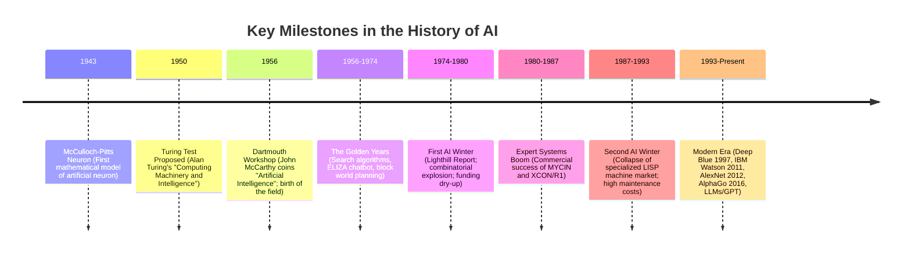

# 🤖 Artificial Intelligence (AI) — Ultimate Revision Notes

> **Source:** Based on the high-yield **"AI in One Shot | Semester Exam | Hindi"** One-Shot Lecture by Sanchit Jain (KnowledgeGate).

---

## 📌 Course Outline & Timestamps
- 🕒 **00:00 - 02:04** | Chapter 0: Introduction & Overview
- 🕒 **02:04 - 01:01:36** | [Chapter 1: Introduction to AI](#-chapter-1-introduction-to-ai)
- 🕒 **01:01:36 - 03:21:47** | [Chapter 2: Problem Solving Methods](#-chapter-2-problem-solving-methods)
- 🕒 **03:21:47 - 04:34:06** | [Chapter 3: Knowledge Representation](#-chapter-3-knowledge-representation)
- 🕒 **04:34:06 - 05:08:56** | [Chapter 4: Software Agents](#-chapter-4-software-agents)
- 🕒 **05:08:56 - End** | [Chapter 5: Applications of AI](#-chapter-5-applications-of-ai)

---

## 📁 Chapter 1: Introduction to AI

### 1.1 Defining Artificial Intelligence
Artificial Intelligence (AI) is the study of systems that receive percepts from the environment and perform actions. Historically, AI has been defined along two dimensions: **thought processes/reasoning** vs. **behavior/action**, and **human-like** vs. **rational (ideal)** performance.

This gives rise to the classic **Four Definitions of AI**:

| | **Human-Like (Empirical)** | **Rational (Ideal/Mathematical)** |
| :--- | :--- | :--- |
| **Thinking** | **Thinking Humanly (Cognitive Science):**<br>Determining how humans think by matching machine reasoning step-by-step with human cognitive processes (e.g., via cognitive modeling, psychological experiments, brain imaging). | **Thinking Rationally (Laws of Thought):**<br>Using formal logic (e.g., Aristotle's syllogisms) to make correct inferences. Focuses on codifying "right thinking" using logic programming systems. |
| **Acting** | **Acting Humanly (Turing Test):**<br>Designing systems that perform actions that would require intelligence if performed by humans. Evaluated by whether a machine's behavior is indistinguishable from a human's. | **Acting Rationally (Rational Agents):**<br>Designing agents that act to achieve the best outcome, or the best expected outcome under uncertainty. Focuses on goal-directed behavior. |

---

### 1.2 The Turing Test (Alan Turing, 1950)
Alan Turing proposed the "Imitation Game" to bypass the philosophical question "Can machines think?" by replacing it with a behavioral test of intelligence.

```
                  ┌────────────────────────┐
                  │   Human Evaluator (C)  │
                  └───────────┬────────────┘
                              │ (Text Queries Only)
              ┌───────────────┴───────────────┐
              ▼                               ▼
     ┌─────────────────┐             ┌─────────────────┐
     │   Computer (A)  │             │    Human (B)    │
     └─────────────────┘             └─────────────────┘
```

#### ⚙️ Test Setup & Mechanics
* **Participants:** A computer ($A$), a human ($B$), and a human evaluator ($C$).
* **Protocol:** The evaluator is separated from $A$ and $B$ and can communicate only via written text messages (teletype/terminal).
* **Goal:** $C$ must determine which terminal is operated by the computer and which by the human.
* **Success Condition:** If the evaluator cannot tell the computer from the human after 5 minutes of questioning, the computer passes.

#### 🧰 Core Capabilities Required to Pass
1. **Natural Language Processing (NLP):** To communicate successfully in a natural tongue (e.g., English, Hindi).
2. **Knowledge Representation:** To store facts, experiences, and information received before or during the conversation.
3. **Automated Reasoning:** To use stored information to answer questions, draw conclusions, and detect contradictions.
4. **Machine Learning:** To adapt to new circumstances, learn from past mistakes, and detect patterns.

#### 👁️ The Total Turing Test
To pass, the computer must also interact physically with the environment. This requires:
* **Computer Vision:** To perceive objects, recognize facial expressions, and navigate.
* **Robotics:** To manipulate objects, move around, and perform physical actions.

---

### 1.3 History of Artificial Intelligence
The evolution of AI is marked by waves of intense optimism followed by periods of disappointment and funding cuts, known as **AI Winters**.



#### ❄️ The AI Winters Explained
* **First AI Winter (1974–1980):** Caused by the realization of the **combinatorial explosion** in search spaces and the severe limitations of early models (e.g., Minsky and Papert proved that Perceptrons could not learn the simple XOR function). Government funding (DARPA, UK Council) was slashed.
* **Second AI Winter (1987–1993):** Caused by the high cost and maintenance difficulty of proprietary **Expert Systems**. They were fragile, hard to update, and could not handle uncertainty, leading to the collapse of specialized hardware markets (like LISP machines) in favor of standard desktop PCs.

---

## 📁 Chapter 2: Problem Solving Methods

### 2.1 State Space Search Formulation
In AI, problem-solving is often framed as a goal-directed search through a state space. A search problem is formally defined by five components:

1. **Initial State:** The state where the agent starts (e.g., $In(Arad)$).
2. **Actions:** The set of actions available to the agent in state $s$. Formally, $Actions(s)$ returns the list of actions that can be executed.
3. **Transition Model:** A description of what each action does. Formally, $Result(s, a)$ returns the state reached by executing action $a$ in state $s$.
4. **Goal Test:** A function that determines whether a given state is a goal state (e.g., $s = In(Bucharest)$).
5. **Path Cost:** A function that assigns a numeric cost to a path (e.g., the sum of step costs/distances between cities).

---

### 2.2 Uninformed Search Strategies (Blind Search)
Uninformed search strategies have no domain-specific knowledge about the distance from the current state to the goal. They only generate successors and distinguish goal states from non-goal states.

#### 📊 Performance Comparison Matrix

| Search Strategy | Frontier Queue Type | Completeness | Time Complexity | Space Complexity | Optimality |
| :--- | :--- | :--- | :--- | :--- | :--- |
| **BFS (Breadth-First)** | FIFO (First-In, First-Out) | **Yes** (if $b$ is finite) | $O(b^d)$ | $O(b^d)$ (Exorbitant) | **Yes** (if step cost is constant) |
| **DFS (Depth-First)** | LIFO (Last-In, First-Out) | **No** (fails in infinite paths) | $O(b^m)$ | $O(b \cdot m)$ (Linear/Excellent) | **No** |
| **DLS (Depth-Limited)** | LIFO (with depth limit $l$) | **No** (if $d > l$) | $O(b^l)$ | $O(b \cdot l)$ | **No** |
| **IDS (Iterative Deepening)**| LIFO (increasing limit $l$) | **Yes** (if $b$ is finite) | $O(b^d)$ | $O(b \cdot d)$ (Linear/Excellent) | **Yes** (if step cost is constant) |
| **UCS (Uniform Cost)** | Priority Queue (by path cost $g$) | **Yes** (if step cost $\ge \epsilon > 0$) | $O(b^{1 + \lfloor C^* / \epsilon \rfloor})$ | $O(b^{1 + \lfloor C^* / \epsilon \rfloor})$ | **Yes** (for any positive step costs) |

*Notation: $b$ = branching factor, $d$ = depth of the shallowest goal node, $m$ = maximum depth of the state space, $C^*$ = cost of the optimal solution, $\epsilon$ = minimum step cost.*

---

### 2.3 Informed (Heuristic) Search Strategies
Informed search strategies use domain-specific knowledge via a **heuristic function** $h(n)$ to guide the search.
* $h(n)$ = estimated cost of the cheapest path from node $n$ to a goal node. (Note: $h(Goal) = 0$).

#### 1️⃣ Greedy Best-First Search
* **Evaluation Function:** $f(n) = h(n)$
* **Strategy:** Always expands the node that appears closest to the goal.
* **Drawbacks:** Not complete (can get stuck in loops), not optimal.

#### 2️⃣ A* Search
* **Evaluation Function:** $f(n) = g(n) + h(n)$
  * $g(n)$ = actual path cost incurred from the start node to node $n$.
  * $h(n)$ = estimated cost from $n$ to the goal.
  * $f(n)$ = estimated total cost of path through $n$ to the goal.

> [!IMPORTANT]
> **Conditions for A* Optimality:**
> 1. **Admissibility (Tree Search):** The heuristic $h(n)$ must never overestimate the actual cost to reach the goal. 
>    $$h(n) \le h^*(n) \quad (\text{where } h^*(n) \text{ is the true optimal cost})$$
> 2. **Consistency/Monotonicity (Graph Search):** For every node $n$ and every successor $n'$ of $n$ generated by action $a$:
>    $$h(n) \le c(n, a, n') + h(n')$$
> If a heuristic is consistent, it is also admissible. When these conditions are met, A* is guaranteed to find the optimal path.

#### 3️⃣ AO* Search (AND-OR Graphs)
Used for decomposing a main problem into smaller sub-problems.
* **OR Nodes:** Represent choice points (solve either Subproblem A **OR** Subproblem B).
* **AND Nodes:** Represent decomposition points (solve Subproblem A **AND** Subproblem B to solve the parent problem).
* **Evaluation:** Updates heuristics backwards from leaf nodes using path cost formulas matching the AND/OR splits.

---

### 2.4 Local Search & Optimization
Local search algorithms operate using a single current node rather than exploring paths. They are highly space-efficient as they do not maintain a search tree.

#### ⛰️ Hill Climbing Search
A simple loop that continuously moves in the direction of increasing value (steepest ascent).

```
         Value / Objective Function
             ▲
             │          Local Maximum
             │             ┌───┐
             │            /     \
             │           /       \       Global Maximum
             │  Plateau /         \          ┌───┐
             │   ───────           \        /     \
             │                      \      /       \
             │                       \____/         \
             └─────────────────────────────────────────► State Space
```

##### ⚠️ Three Main Pitfalls of Hill Climbing
1. **Local Maxima:** A peak that is higher than all its neighboring states, but lower than the global maximum. The algorithm gets stuck here because all moves lead downward.
2. **Ridges:** A sequence of local maxima joined together. The slope is steep on both sides, but very gentle along the ridge itself, causing the search to oscillate and stall.
3. **Plateaus:** A flat area of the state space where the evaluation function is uniform. The algorithm conducts a random walk without clear direction (stalls on a "shoulder" or flat local maximum).

#### 🌡️ Simulated Annealing
Designed to escape local maxima by combining hill climbing with random walks.
* If a neighboring state has a better value, it is accepted immediately.
* If the neighbor has a worse value, it is accepted with a probability:
  $$P = e^{\frac{\Delta E}{T}}$$
  * $\Delta E$ = difference in objective function values (negative for worse moves).
  * $T$ = "Temperature" parameter, which starts high and decreases according to an **annealing schedule**.
* **Intuition:** Early on (high $T$), the agent accepts bad moves easily to explore the space. As $T \to 0$, it becomes strictly greedy, settling into the global optimum.

---

### 2.5 Constraint Satisfaction Problems (CSP)
A Constraint Satisfaction Problem defines a state space where states are assignments of values to variables.

* **Variables ($X$):** A set of variables, $\{X_1, X_2, \dots, X_n\}$.
* **Domains ($D$):** A set of allowable values for each variable, $\{D_1, D_2, \dots, D_n\}$.
* **Constraints ($C$):** Rules specifying allowed combinations of values (e.g., $X_1 \neq X_2$).

#### 🔄 Constraint Propagation (AC-3 Algorithm)
Instead of searching, we can prune variable domains before or during search.
* **Arc Consistency:** A directed arc $X_i \to X_j$ is consistent if, for every value $x \in D_i$, there exists some value $y \in D_j$ that satisfies the constraints between $X_i$ and $X_j$.
* **AC-3 Algorithm:** Manages a queue of arcs. If an arc $X_i \to X_j$ is inconsistent, we remove values from $D_i$ to make it consistent and re-add all neighboring arcs $X_k \to X_i$ back to the queue to propagate the changes.

#### ✍️ Cryptarithmetic Example
```
    S E N D
  + M O R E
  ---------
  M O N E Y
```

* **Variables:** $\{S, E, N, D, M, O, R, Y\} \subset \{0, 1, \dots, 9\}$ and carries $\{C_1, C_2, C_3, C_4\} \subset \{0, 1\}$.
* **Constraints:**
  * $Alldiff(S, E, N, D, M, O, R, Y)$
  * $S \neq 0, M \neq 0$
  * $D + E = Y + 10 \cdot C_1$
  * $N + R + C_1 = E + 10 \cdot C_2$
  * $E + O + C_2 = N + 10 \cdot C_3$
  * $S + M + C_3 = O + 10 \cdot C_4$
  * $C_4 = M$ (Since $M \neq 0$ and $C_4$ must be 0 or 1, $M = 1$ is inferred instantly by constraint propagation!)

---

### 2.6 Adversarial Search (Game Playing)
Adversarial search involves environments where multiple agents compete (e.g., Chess, Tic-Tac-Toe).

#### 1️⃣ Minimax Algorithm
Used in two-player, zero-sum, perfect-information games.
* **MAX Player:** Seeks to maximize the game utility.
* **MIN Player:** Seeks to minimize the game utility.
* **Recursion:**
  $$\text{Minimax}(s) = \begin{cases} 
  \text{Utility}(s) & \text{if } Terminal(s) \\
  \max_{a \in Actions(s)} \text{Minimax}(Result(s, a)) & \text{if } Player(s) = MAX \\
  \min_{a \in Actions(s)} \text{Minimax}(Result(s, a)) & \text{if } Player(s) = MIN
  \end{cases}$$

#### 2️⃣ Alpha-Beta Pruning
An optimization that returns the exact same move as Minimax but prunes branches that cannot affect the final decision.

```
                      MAX [ α = 3 ]
                        /       \
                       /         \
                 MIN [3]          MIN [ β = 2 ]  <-- Prune! (since α >= β, i.e., 3 >= 2)
                 /    \              /     \
                3      12           2       [Not Evaluated]
```

* **Alpha ($\alpha$):** The value of the best (highest-value) choice found so far along the path for MAX.
* **Beta ($\beta$):** The value of the best (lowest-value) choice found so far along the path for MIN.
* **Pruning Rule:** If at any point during search, $\alpha \ge \beta$ at a node, the remaining branches of this node can be pruned because the opponent (MIN or MAX) will never allow this path to be chosen.

#### 3️⃣ Stochastic Games (Expectiminimax)
For games with chance/probabilistic elements (e.g., rolling dice in Backgammon).
* **Chance Nodes:** Added between MAX and MIN layers.
* The value of a chance node is the **expected value** of its children:
  $$\text{Expectiminimax}(s) = \sum_{r} P(r) \cdot \text{Expectiminimax}(Result(s, r))$$
  *Where $P(r)$ is the probability of outcome $r$.*

---

## 📁 Chapter 3: Knowledge Representation

### 3.1 Knowledge Representation Schemes
Knowledge must be represented internally in formats that allow computers to draw inferences.

#### 🕸️ Semantic Networks
* Represent knowledge as a directed graph.
* **Nodes:** Represent objects, concepts, or situations.
* **Edges:** Represent relationships between nodes. Common relations include:
  * `is-a` (Class inheritance: e.g., `Dog` $\xrightarrow{is-a}$ `Mammal`).
  * `has-a` (Part-whole relation: e.g., `Car` $\xrightarrow{has-a}$ `Engine`).

#### 🗃️ Frame Representation
* A record-like data structure containing collection of attributes (**slots**) and their values (**fillers**).
* Supports default values and inheritance.
* *Example:*
  ```
  Frame: Dog
    Inherits: Mammal
    Slots:
      Legs: 4 (Default)
      Barks: True
      Owner: Unknown
  ```

#### 🔄 Conceptual Dependency (Schank)
A theory of representing the semantics of natural language sentences by breaking them down into fundamental psychological primitives called **primitive ACTs**:
* **ATRANS:** Transfer of an abstract relationship (e.g., giving, buying).
* **PTRANS:** Transfer of physical location of an object (e.g., walking, throwing).
* **MTRANS:** Transfer of mental information (e.g., telling, remembering).
* **PROPEL:** Application of physical force to an object (e.g., pushing, pulling).

---

### 3.2 First-Order Predicate Logic (FOPL)
While Propositional Logic is limited to facts that are either true or false, FOPL represents objects, properties, and relations, using **Quantifiers**.

#### 🔢 Key Symbols
* **Universal Quantifier ($\forall$):** "For all". Typically used with implication ($\implies$).
  * *Example:* "All students are smart" $\to \forall x (Student(x) \implies Smart(x))$
* **Existential Quantifier ($\exists$):** "There exists at least one". Typically used with conjunction ($\land$).
  * *Example:* "Some students are smart" $\to \exists x (Student(x) \land Smart(x))$

> [!WARNING]
> **Common Fallacy:** Writing "All students are smart" with $\land$ ($\forall x (Student(x) \land Smart(x))$) means "Everyone in the universe is a student and everyone in the universe is smart." Avoid this error!

---

### 3.3 Logical Inference & Reasoning

#### 1️⃣ Inference Rules
* **Modus Ponens:**
  $$\frac{P \implies Q, \quad P}{Q}$$
* **Modus Tollens:**
  $$\frac{P \implies Q, \quad \neg Q}{\neg P}$$

#### 2️⃣ Unification
The algorithmic process of finding a substitution $\theta$ of variables that makes two predicate expressions identical.
* *Example:*
  * Expression 1: $Knows(John, x)$
  * Expression 2: $Knows(John, Jane)$
  * Unification: $Unify(Knows(John, x), Knows(John, Jane)) = \{x / Jane\}$

#### 3️⃣ Resolution Refutation (Proof by Contradiction)
To prove a statement $\alpha$ from a Knowledge Base ($KB$), we add $\neg \alpha$ to $KB$, convert all statements to **Conjunctive Normal Form (CNF)**, and repeatedly resolve clauses until we derive an empty clause ($\square$), representing a contradiction.

##### 🧮 CNF Conversion Algorithm Steps
1. **Eliminate Implications:** Replace $P \implies Q$ with $\neg P \lor Q$.
2. **Move Negation Inward:** Apply De Morgan's laws and double-negation elimination:
   $$\neg(P \land Q) \equiv \neg P \lor \neg Q, \quad \neg(\forall x P) \equiv \exists x \neg P$$
3. **Standardize Variables:** Rename variables so that each quantifier binds a unique variable name (e.g., rename duplicate $x$ to $y$).
4. **Skolemize Existential Quantifiers:** Replace existential variables with Skolem constants or Skolem functions.
   * $\exists x Crown(x) \implies Crown(C_1)$ (Skolem constant)
   * $\forall x \exists y (Person(x) \implies Loves(x, y)) \implies \forall x (Person(x) \implies Loves(x, f(x)))$ (Skolem function $f(x)$ depends on $x$).
5. **Drop Universal Quantifiers:** Since all remaining variables are universally quantified, we drop the $\forall$ symbols.
6. **Distribute $\lor$ over $\land$:** Convert the formula into a conjunction of disjunctions (clauses).

#### 4️⃣ Chaining Algorithms

```
                FORWARD CHAINING (Data-Driven)
   [Known Facts] ──► [Apply Rules] ──► [Infer New Facts] ──► [Goal]
   
               BACKWARD CHAINING (Goal-Driven)
   [Goal] ◄── [Find Matching Rules] ◄── [Verify Hypotheses] ◄── [Facts]
```

* **Forward Chaining:** Starts with the known facts in the database and applies rules to infer new facts, repeating the process until the goal is reached.
* **Backward Chaining:** Starts with the goal, checks if it is already known. If not, it finds rules that conclude the goal, and recursively tries to prove the premises of those rules.

---

### 3.4 Ontological Engineering
Ontological engineering is the process of defining the basic categories, objects, situations, and events in a domain.
* **Categories vs. Instances:** Organizing concepts hierarchically (e.g., `Vegetable` is a category; `Carrot` is a subcategory; a specific carrot on a plate is an instance).
* **Non-monotonic Reasoning:** Standard logic is monotonic (adding new facts only increases the set of truths). Modern AI uses non-monotonic reasoning, allowing default assumptions to be retracted when contradictory evidence arrives (e.g., assuming a bird can fly until learning it is a penguin).

---

## 📁 Chapter 4: Software Agents

### 4.1 Basic Definitions
An **Agent** is anything that can perceive its environment through **sensors** and act upon that environment through **actuators**.

* **Sensor:** A device or mechanism that inputs percepts (e.g., cameras, sonar, keystrokes).
* **Actuator:** A device or mechanism that outputs actions (e.g., robotic arms, display screens, motors).
* **Percept Sequence:** A complete history of everything the agent has perceived.

---

### 4.2 The PEAS Framework
When designing an agent, the task environment must be defined using the **PEAS** framework:

| Agent Type | **P**erformance Measure | **E**nvironment | **A**ctuators | **S**ensors |
| :--- | :--- | :--- | :--- | :--- |
| **Taxi Driver** | Safety, speed, legal driving, comfort, profit. | Streets, highways, traffic, pedestrians, weather. | Steering wheel, accelerator, brake, signal, horn. | Cameras, LIDAR, speedometer, GPS, engine sensors. |
| **Vacuum Cleaner** | Cleanliness, efficiency, battery life, noise. | Carpet, tiles, dust, furniture, obstacles. | Wheels, brushes, vacuum motor. | Cliff sensor, bump sensor, dirt sensor, camera. |
| **Medical Diagnostics** | Correct diagnosis, patient recovery, low cost. | Patient, hospital, medical staff. | Display screen (treatment plan, prescriptions). | Keyboard (symptoms, test results), lab devices. |
| **Part-picking Robot** | Percentage of parts placed in correct bins, speed. | Conveyor belt, bins, factory floor. | Jointed robotic arm, gripper. | Camera, joint angle sensors, touch sensors. |

---

### 4.3 Environment Properties

1. **Observable (Fully vs. Partially):** An environment is fully observable if the agent's sensors can detect the complete state of the environment at any point in time. Otherwise, it is partially observable (due to noise or missing data).
2. **Deterministic vs. Stochastic/Nondeterministic:** Deterministic means the next state is completely determined by the current state and the agent's action. If chance/probability is involved, it is stochastic.
3. **Episodic vs. Sequential:** In episodic environments, the agent's experience is divided into independent episodes where current actions do not affect future decisions (e.g., classifying images). In sequential environments, current decisions affect future states (e.g., Chess).
4. **Static vs. Dynamic:** A dynamic environment changes while the agent is deciding on an action (e.g., taxi driving). A static environment does not change (e.g., Crossword puzzle).
5. **Discrete vs. Continuous:** Discrete environments have a finite, distinct number of states and actions (e.g., Chess). Continuous environments have infinite, continuous ranges (e.g., driving a car, temperature controls).
6. **Single-agent vs. Multi-agent:** Single-agent involves an agent operating alone (e.g., Solitaire). Multi-agent involves other agents whose actions affect the performance (e.g., Chess, auction bidding).

---

### 4.4 Agent Architectures

#### 1️⃣ Simple Reflex Agent
Selects actions based only on the current percept, ignoring percept history. Uses condition-action rules.
* *Rule:* `IF car_in_front_is_braking THEN initiate_braking`

```
  Percept ──► [ What the world is like now ] ──► [ Condition-Action Rules ] ──► Action
```

#### 2️⃣ Model-Based Reflex Agent
Maintains an internal state to track aspects of the environment that cannot be viewed right now (handles partial observability).

```
  Percept ──► [ Update State (uses model of world) ] ──► [ Condition-Action Rules ] ──► Action
```

#### 3️⃣ Goal-Based Agent
Uses goal information to select actions that will lead to a desired goal state. Combines state tracking with planning.

```
  Percept ──► [ Update State ] ──► [ What will happen if I do X? ] ──► [ Goal Check ] ──► Action
```

#### 4️⃣ Utility-Based Agent
Uses a utility function to map states to real numbers, measuring how desirable ("happy") a state is. Allows trade-offs when goals conflict.

```
  Percept ──► [ Update State ] ──► [ Evaluate Utility of States ] ──► Action
```

#### 5️⃣ Learning Agent
Divided into four conceptual components:
* **Learning Element:** Responsible for making improvements based on feedback.
* **Performance Element:** Responsible for selecting external actions (the operational agent).
* **Critic:** Evaluates the agent's behavior against an external performance standard.
* **Problem Generator:** Suggests new exploratory actions (experiments) to discover better strategies.

---

## 📁 Chapter 5: Applications of AI

### 5.1 Natural Language Processing (NLP)
NLP enables machines to read, understand, and derive meaning from human languages.
* **Syntactic Analysis (Parsing):** Analyzing grammar rules and structure.
* **Semantic Analysis:** Extracting meaning and resolving ambiguity (Word Sense Disambiguation).
* **Information Retrieval (IR):** Finding documents relevant to user queries (e.g., Search Engines using TF-IDF and PageRank).
* **Information Extraction (IE):** Acquiring structured data from unstructured text (e.g., Named Entity Recognition).
* **Machine Translation & Speech Recognition:** Converting speech to text, and translating between languages using Neural Machine Translation models.

---

### 5.2 Robotics
Robotics deals with physical agents that perform tasks by manipulating physical environments.
* **Sensors:** Convert physical properties (light, sound, distance) to digital signals (e.g., LIDAR, sonar, tactile sensors).
* **Actuators:** Electric motors, hydraulic pistons, and pneumatic systems that move joints and wheels.
* **Localization & Mapping (SLAM):** Simultaneous Localization and Mapping helps robots build a map of an unknown environment while keeping track of their location within it.
* **Path Planning:** Calculating optimal trajectories through configuration spaces using A* algorithms, potential fields, or probabilistic roadmaps.

---

### 5.3 Expert Systems
An expert system is an interactive computer system that mimics the decision-making ability of a human expert in a specific domain.

```
                     ┌──────────────────┐
                     │  User Interface  │
                     └────────┬─────────┘
                              │ Queries / Answers
                     ┌────────▼─────────┐
                     │ Inference Engine │ (Rules & Logic Processor)
                     └────────┬─────────┘
                              │ Matches Rules
                     ┌────────▼─────────┐
                     │  Knowledge Base  │ (IF-THEN Rules & Facts)
                     └──────────────────┘
```

* **Knowledge Base:** Stores the domain-specific facts and heuristic rules (usually expressed as IF-THEN rules).
* **Inference Engine:** Applies logical rules to the knowledge base to deduce new information or answer user queries.
* **User Interface:** Provides an interactive portal for non-expert users to enter symptoms/data and receive recommendations.
* **Examples:** MYCIN (medical diagnosis), XCON/R1 (computer hardware configuration).
