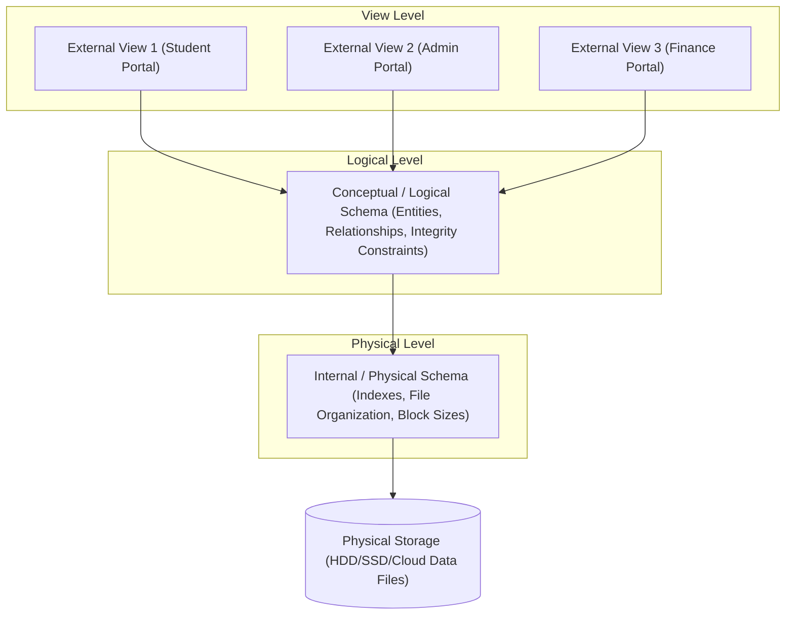
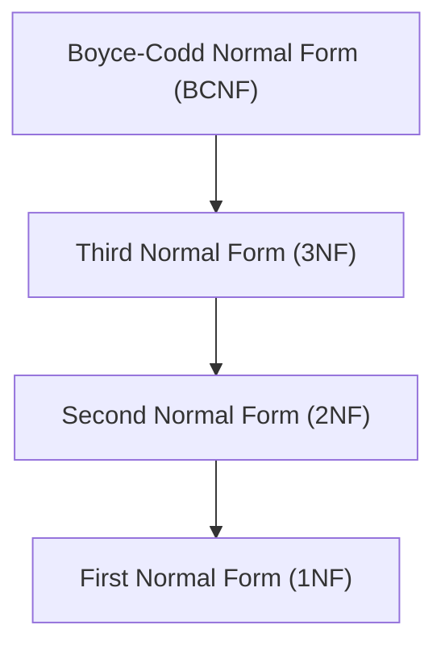

# 🗄️ Database Management Systems (DBMS) — Ultimate Revision Notes
> **Source:** Based on the high-yield **"DBMS in 100 Minutes | Complete Placement Revision"** One-Shot Lecture by Sanchit Jain (KnowledgeGate).

---

## 📌 Course Outline & Timestamps
- 🕒 **00:00 - 03:19** | Introduction
- 🕒 **03:19 - 15:13** | [Chapter 1: Basics of DBMS](#-chapter-1-basics-of-dbms)
- 🕒 **15:13 - 25:28** | [Chapter 2: Entity-Relationship (ER) Model](#-chapter-2-entity-relationship-er-model)
- 🕒 **25:28 - 41:43** | [Chapter 3: Functional Dependencies (FDs) & Key Extraction](#-chapter-3-functional-dependencies-fds--key-extraction)
- 🕒 **41:43 - 53:55** | [Chapter 4: Database Normalization](#-chapter-4-database-normalization)
- 🕒 **53:55 - 01:08:36** | [Chapter 5: Indexing Techniques](#-chapter-5-indexing-techniques)
- 🕒 **01:08:36 - End** | [Chapter 6: Structured Query Language (SQL)](#-chapter-6-structured-query-language-sql)

---

## 📁 Chapter 1: Basics of DBMS

### 1.1 Fundamental Concepts
*   **Data:** Raw, unorganized, and unprocessed facts, observations, or figures (e.g., "101", "John", "50000").
*   **Information:** Data that has been processed, structured, formatted, or presented in a meaningful context (e.g., "Employee ID 101, named John, has a salary of $50,000").
*   **Database:** A systematic, logically organized, and sharing-enabled collection of related data.
*   **DBMS (Database Management System):** A specialized software package designed to define, store, manipulate, retrieve, and manage databases efficiently and securely (e.g., MySQL, Oracle, PostgreSQL, SQL Server).

---

### 1.2 File System vs. Database Management System
Before DBMS, data was managed using traditional operating system files. This approach had severe limitations:

| Feature / Problem | File System Approach | DBMS Approach |
| :--- | :--- | :--- |
| **Data Redundancy & Inconsistency** | **High:** Multiple copies of the same data are stored in different files, leading to storage waste and conflicting records. | **Low:** Centralized storage database architecture minimizes duplication; updates propagate automatically. |
| **Data Access & Querying** | **Difficult:** Requires writing custom programs (e.g., in C/Java) to search, filter, or retrieve specific data. | **Easy:** Standardized, declarative querying languages (SQL) allow rapid data extraction. |
| **Data Isolation** | **High:** Data is scattered in different files and formats, making integration highly complex. | **Low:** Integrated logical schema brings all data entities into a unified view. |
| **Concurrent Access** | **Unsafe:** If two users edit the same file simultaneously, updates are overwritten (loss of data integrity). | **Safe:** Lock-based and time-stamp protocols manage concurrent operations safely. |
| **Security & Authorization** | **Basic:** File-level access permissions (Read/Write/Execute) are too coarse. | **Granular:** Column, table, and row-level access control based on user roles. |
| **Crash Recovery** | **Absent/Weak:** If a system crashes mid-write, files get corrupted. | **Robust:** Write-ahead logging (WAL) and recovery managers restore state using transaction logs. |

---

### 1.3 Three-Schema Architecture (ANSI-SPARC)
To hide complexity and provide logical/physical separation of data, DBMS uses a **Three-Level Architecture**:



1.  **External Level (View Schema):**
    *   The highest level of abstraction.
    *   Defines how end-users or application programs interact with the database.
    *   Allows different users to see custom, simplified views of the same database based on their roles.
2.  **Conceptual Level (Logical Schema):**
    *   The middle level of abstraction.
    *   Defines *what* data is stored in the database and *what relationships* exist among those data items.
    *   Contains tables, schemas, entities, data types, and integrity constraints without worrying about physical storage.
3.  **Internal Level (Physical Schema):**
    *   The lowest level of database design.
    *   Defines *how* the data is physically stored in the secondary storage devices.
    *   Describes block allocations, record sizes, index structures (B+ trees, hashing), and data compression techniques.

---

### 1.4 Data Independence
Data independence refers to the ability to modify schema definition at one level without affecting the schemas at higher levels.

```
┌──────────────────────────────────────────────┐
│             External View / Schema           │
└──────────────────────────────────────────────┘
                       ▲
                       │  [Logical Data Independence]
                       ▼
┌──────────────────────────────────────────────┐
│           Conceptual / Logical Schema        │
└──────────────────────────────────────────────┘
                       ▲
                       │  [Physical Data Independence]
                       ▼
┌──────────────────────────────────────────────┐
│           Internal / Physical Schema         │
└──────────────────────────────────────────────┘
```

*   **Logical Data Independence:**
    *   The ability to modify the conceptual schema (e.g., adding/deleting columns, split/merge tables) without changing the external schema or existing application programs.
    *   *Example:* If a new column `DateOfBirth` is added to a `Student` table, the existing queries that select only `StudentID` and `StudentName` do not break.
*   **Physical Data Independence:**
    *   The ability to modify the physical schema (e.g., changing index types, migrating from HDD to SSD, altering block size) without changing the conceptual/logical schema.
    *   *Example:* Creating a B+ Tree index on the `Email` column to speed up queries does not change the table design or SQL code structure.

---

## 📊 Chapter 2: Entity-Relationship (ER) Model

The Entity-Relationship (ER) model is a visual blueprint of a database representing real-world entities, attributes, and relationships. It is converted into physical relational tables during the implementation phase.

### 2.1 Core Elements
*   **Entity:** A distinct, real-world object or event that is distinguishable from other objects (e.g., a specific `Student`, `Course`, `Employee`).
    *   *Representation:* Rectangle.
*   **Entity Set:** A collection of entities of the same type sharing similar properties (e.g., all Students in a university).
*   **Attribute:** Characteristics or properties that describe an entity (e.g., `Name`, `RollNumber`, `Salary`).
    *   *Representation:* Oval (connected to the entity).

---

### 2.2 Classification of Attributes
Understanding attribute types is essential for proper schema design:

```
                  ┌──────────────────────────────┐
                  │          ATTRIBUTES          │
                  └──────────────┬───────────────┘
         ┌───────────────┬───────┴───────┬───────────────┐
         ▼               ▼               ▼               ▼
   ┌───────────┐   ┌───────────┐   ┌───────────┐   ┌───────────┐
   │  Simple   │   │Single-Val │   │ Key Att.  │   │  Derived  │
   │    vs.    │   │    vs.    │   │(Underline)│   │  (Dashed  │
   │ Composite │   │Multi-Val  │   └───────────┘   │   Oval)   │
   └───────────┘   └───────────┘                   └───────────┘
```

1.  **Simple vs. Composite:**
    *   **Simple Attributes:** Atomic values that cannot be split further (e.g., `RollNumber`, `Salary`).
    *   **Composite Attributes:** Can be divided into smaller sub-parts to represent independent values (e.g., `Name` split into `First_Name`, `Middle_Name`, `Last_Name`).
2.  **Single-valued vs. Multi-valued:**
    *   **Single-valued:** Holds exactly one value for a given entity instance (e.g., `DateOfBirth`, `AadhaarNumber`).
    *   **Multi-valued:** Can hold multiple values for a single entity (e.g., `Phone_Number` (mobile and home), `Skills`).
    *   *Representation:* Double Oval.
3.  **Derived Attributes:**
    *   Values that are not stored directly in the database but calculated from other stored attributes.
    *   *Example:* Calculating `Age` dynamically using the current date and `DateOfBirth`.
    *   *Representation:* Dashed Oval.
4.  **Key Attribute:**
    *   An attribute whose values uniquely identify each entity in an entity set (e.g., `Roll_Number` in `Student`).
    *   *Representation:* Oval with underlined text.

---

### 2.3 Strong vs. Weak Entity Sets

| Characteristic | Strong Entity Set | Weak Entity Set |
| :--- | :--- | :--- |
| **Primary Key** | Has its own primary key (e.g., `Emp_ID`). | Does not have a primary key. It relies on a strong entity. |
| **Discriminator** | Not required (uses primary key). | Uses a **partial key / discriminator** (dashed underline) to differentiate between weak entities sharing the same owner. |
| **Dependency** | Independent existence. | Existentially dependent on an identifying owner entity set. |
| **ER representation** | Single Rectangle | Double Rectangle |
| **Relationship representation**| Single Diamond | Double Diamond (Identifying Relationship) |

> [!NOTE]
> *Example:* A `Dependents` table (child name, age) is a weak entity set dependent on the `Employee` strong entity. If the employee leaves the company, their dependents' records are deleted automatically.

---

### 2.4 Cardinality Constraints (Mapping Constraints)
Cardinality defines the number of entity instances of one entity set that can be associated with entity instances of another set via a relationship.

1.  **One-to-One (1:1):** An instance in Entity Set A is associated with at most one instance in Entity Set B, and vice versa.
    *   *Example:* `Citizen` ── (1) ── [Has] ── (1) ── `Passport`.
2.  **One-to-Many (1:N):** An instance in A is associated with multiple instances in B, but an instance in B is associated with at most one instance in A.
    *   *Example:* `Department` ── (1) ── [Employs] ── (N) ── `Employee`.
3.  **Many-to-One (N:1):** Multiple instances in A are associated with at most one instance in B.
    *   *Example:* `Employee` ── (N) ── [Works_In] ── (1) ── `Department`.
4.  **Many-to-Many (M:N):** An instance in A is associated with multiple instances in B, and vice versa.
    *   *Example:* `Student` ── (M) ── [Enroll] ── (N) ── `Course`.

---

### 2.5 Participation Constraints
*   **Total Participation (Double Line):** Every entity in the entity set must participate in at least one relationship instance.
    *   *Example:* Every `Employee` **must** work in a `Department`.
*   **Partial Participation (Single Line):** Entities in the entity set may or may not participate in relationship instances.
    *   *Example:* Not every `Employee` is a manager of a `Department`.

---

### 2.6 ER Diagram to Relational Tables Conversion Rules
To translate a conceptual ER diagram into standard relational tables (RDBMS), follow these structural rules:

1.  **Strong Entity Set:** Map directly to a standalone table. All simple attributes become columns. Composite attributes are flattened (sub-parts become columns).
2.  **Weak Entity Set:** Map to a separate table. Columns include:
    *   All attributes of the weak entity set.
    *   The primary key of the identifying strong entity set (acting as a Foreign Key).
    *   *Primary Key of Weak Table:* Composite key combining (Strong Entity PK + Weak Entity Discriminator).
3.  **Relationship Sets (M:N):** Must create a distinct table.
    *   *Columns:* Primary keys of both participating entity sets + any descriptive attributes of the relationship.
    *   *Primary Key:* Composite key of both foreign keys.
4.  **Relationship Sets (1:N / N:1):** Do NOT create a separate table. Instead, take the primary key from the "One" side and add it as a **Foreign Key** in the "Many" side's table.
5.  **Relationship Sets (1:1):** No separate table. Put the primary key of either table into the other table as a foreign key. To prevent NULL values, choose the table with **total participation** to receive the foreign key.

---

## 🔑 Chapter 3: Functional Dependencies (FDs) & Key Extraction

Functional Dependency is the formal mathematical foundation used to evaluate schema design, calculate keys, and eliminate data redundancy.

### 3.1 Understanding Functional Dependency (FD)
An FD is represented as $X \rightarrow Y$ (Read: "$X$ functionally determines $Y$" or "$Y$ is functionally dependent on $X$").
*   **Definition:** If two tuples (rows) have identical values in attributes $X$, they must have identical values in attributes $Y$.
    *   If $t_1[X] = t_2[X]$, then $t_1[Y] = t_2[Y]$ must hold true.
*   **Trivial Dependency:** If the dependent (RHS) is a subset of the determinant (LHS).
    *   $X \rightarrow Y$ is trivial if $Y \subseteq X$ (e.g., $A, B \rightarrow A$ or $Id, Name \rightarrow Id$).
*   **Non-Trivial Dependency:** If the dependent is not a subset of the determinant.
    *   $X \rightarrow Y$ is non-trivial if $Y \not\subseteq X$ (e.g., $RollNumber \rightarrow Name$).
    *   It is **completely non-trivial** if $X \cap Y = \emptyset$.

---

### 3.2 Attribute Closure ($X^+$)
The attribute closure of a set of attributes $X$ (denoted as $X^+$) is the complete set of all attributes in a relation that can be determined logically using the given set of Functional Dependencies.

#### 🧮 Step-by-Step Closure Algorithm
1.  Initialize $X^+ = X$.
2.  Loop through the list of FDs: If the Left-Hand Side (LHS) of any FD $A \rightarrow B$ is a subset of the current $X^+$, add the Right-Hand Side (RHS) $B$ to $X^+$.
3.  Repeat this process until no new attributes can be added to $X^+$.

> [!TIP]
> **Worked Example:**
> Let Relation $R(A, B, C, D, E)$ and FDs:
> 1. $A \rightarrow B$
> 2. $B \rightarrow C$
> 3. $C \rightarrow D$
> 4. $E \rightarrow A$
>
> Let's calculate the closure for $\{A\}$:
> *   Step 1: $A^+ = \{A\}$
> *   Step 2: Check FDs.
>     *   Using $A \rightarrow B$ (since $A \subseteq A^+$): $A^+ = \{A, B\}$
>     *   Using $B \rightarrow C$ (since $B \subseteq A^+$): $A^+ = \{A, B, C\}$
>     *   Using $C \rightarrow D$ (since $C \subseteq A^+$): $A^+ = \{A, B, C, D\}$
>     *   $E \rightarrow A$ cannot be used because $E \not\subseteq A^+$.
> *   Result: $A^+ = \{A, B, C, D\}$. Since it does not contain $E$, $A$ alone cannot be a candidate key.

---

### 3.3 Keys in RDBMS
*   **Super Key:** A set of one or more attributes that, taken collectively, can uniquely identify a row in a table.
    *   *Condition:* If $X^+ = R$ (the entire relation's attributes), then $X$ is a Super Key.
*   **Candidate Key (CK):** A **minimal** Super Key. No proper subset of a candidate key can be a super key.
    *   *Condition:* $X$ is a Candidate Key if $X^+ = R$, and for any attribute $A \in X$, $(X - \{A\})^+ \neq R$.
*   **Primary Key (PK):** A candidate key selected by the database designer to uniquely identify records. Cannot accept NULL values.
*   **Prime Attribute:** An attribute that is a member of *any* Candidate Key.
*   **Non-Prime Attribute:** An attribute that is *not* a part of any Candidate Key.

---

### 3.4 Sanchit Sir's Cheat Code: Finding Candidate Keys Instantly
For GATE and semester exams, finding Candidate Keys of a relation $R$ under a set of FDs can be tedious. Use this shortcut:

```
                  ┌──────────────────────────────┐
                  │      Check FD list for:      │
                  └──────────────┬───────────────┘
         ┌───────────────────────┴───────────────────────┐
         ▼                                               ▼
┌─────────────────────────────────┐             ┌─────────────────────────────────┐
│ Attributes NEVER on the RHS     │             │ Attributes NEVER on the LHS     │
│ of any FD.                      │             │ of any FD.                      │
├─────────────────────────────────┤             ├─────────────────────────────────┤
│ ✔ Must be present in EVERY CK!  │             │ ✘ Will NEVER be part of any CK! │
└─────────────────────────────────┘             └─────────────────────────────────┘
```

1.  **Rule 1 (Essential Attributes):** Identify all attributes that only appear on the Left-Hand Side (LHS) or do not appear in any FDs. These attributes **MUST** be part of every candidate key.
2.  **Rule 2 (Useless Attributes):** Identify attributes that only appear on the Right-Hand Side (RHS). These will **NEVER** be part of any Candidate Key.
3.  **Step-by-step Application:**
    *   Find the closure of the "essential attributes".
    *   If the closure contains all attributes of $R$, then this set is the **one and only** Candidate Key.
    *   If the closure is incomplete, combine the essential attributes with other attributes (excluding RHS-only attributes) one by one, and calculate their closures to find all minimal keys.

> [!IMPORTANT]
> **Example Application:**
> Let $R(A, B, C, D, E, F)$ and FDs:
> *   $A \rightarrow B$
> *   $C \rightarrow D$
> *   $D \rightarrow E$
> *   $B \rightarrow F$
>
> 1. Look at LHS and RHS:
>    *   **LHS attributes:** $A, C, D, B$
>    *   **RHS attributes:** $B, D, E, F$
> 2. Find missing/essential:
>    *   $A$ and $C$ are **never** on the RHS of any FD. Hence, $\{A, C\}$ **must** be present in every Candidate Key.
> 3. Check $(AC)^+$ closure:
>    *   $(AC)^+ = \{A, C\}$
>    *   Applying $A \rightarrow B \implies \{A, C, B\}$
>    *   Applying $C \rightarrow D \implies \{A, C, B, D\}$
>    *   Applying $D \rightarrow E \implies \{A, C, B, D, E\}$
>    *   Applying $B \rightarrow F \implies \{A, C, B, D, E, F\}$
> 4. Since $(AC)^+ = R$, $\{A, C\}$ is the **only Candidate Key** for this relation.

---

## ⚙️ Chapter 4: Database Normalization

Normalization is a systematic process of decomposing database tables to eliminate data redundancy and prevent operational anomalies.

### 4.1 Database Anomalies
If a database is not normalized, it suffers from three primary anomalies:
1.  **Insertion Anomaly:** Inability to insert certain data because other data is not yet available.
    *   *Example:* Cannot insert a new department's details until at least one employee is hired and assigned to it.
2.  **Deletion Anomaly:** The unintentional loss of data caused by the deletion of unrelated records.
    *   *Example:* Deleting the last employee of a department accidentally deletes all details of that department.
3.  **Update Anomaly:** Inconsistency that occurs when updating duplicate data in multiple rows.
    *   *Example:* If a department name changes, we must update it in every employee record. Missing even one row leads to inconsistent database states.

---

### 4.2 Hierarchy of Normal Forms
Database schemas are structured into progressively stricter normal forms. If a database is in BCNF, it is automatically in 3NF, 2NF, and 1NF.



---

### 4.3 Detailed Rules of Normal Forms

#### 1️⃣ First Normal Form (1NF)
*   **Rule:** Every attribute (column) must contain only **atomic** (indivisible) values.
*   **Violations:** Multivalued attributes, composite attributes, or nested relations are not allowed.
*   *Solution:* Split multivalued records into separate rows or separate tables.

#### 2️⃣ Second Normal Form (2NF)
*   **Rule:** Must be in 1NF, and there must be **no Partial Dependency**.
*   **Partial Dependency:** Occurs when a non-prime attribute depends on a *proper subset* of a Candidate Key.
    *   Formally, $X \rightarrow Y$ is a partial dependency if $X$ is a proper subset of a Candidate Key, and $Y$ is a non-prime attribute.
    *   *Condition for 2NF:* No FD should look like:
        $$\text{Proper Subset of CK} \rightarrow \text{Non-Prime Attribute}$$

#### 3️⃣ Third Normal Form (3NF)
*   **Rule:** Must be in 2NF, and there must be **no Transitive Dependency**.
*   **Transitive Dependency:** A non-prime attribute determines another non-prime attribute.
*   *Condition for 3NF:* For every non-trivial functional dependency $X \rightarrow Y$, **at least one** of the following conditions must hold:
    1.  $X$ is a **Super Key** (LHS is a key).
    2.  $Y$ is a **Prime Attribute** (RHS is part of some candidate key).

#### 4️⃣ Boyce-Codd Normal Form (BCNF)
*   **Rule:** A stricter version of 3NF.
*   *Condition for BCNF:* For every non-trivial functional dependency $X \rightarrow Y$:
    1.  $X$ must be a **Super Key** (LHS must be a key).
    *   *Note:* The 3NF escape hatch (where $Y$ can be a prime attribute) is removed here.

---

### 📊 Quick Comparison Matrix of Normal Forms

| Normal Form | Core Target | Rule Condition for $X \rightarrow Y$ | Lossless Join Guarantee | Dependency Preservation Guarantee |
| :--- | :--- | :--- | :--- | :--- |
| **1NF** | Atomic values | No multivalued attributes | Yes | Yes |
| **2NF** | Eliminate Partial Dependencies | $\text{Proper Subset of CK} \not\rightarrow \text{Non-Prime}$ | Yes | Yes |
| **3NF** | Eliminate Transitive Dependencies | $X$ is Super Key **OR** $Y$ is Prime | Yes | Yes |
| **BCNF** | Eliminate all anomalies | $X$ must be a Super Key | Yes | No (May not preserve all FDs) |

---

## 🔍 Chapter 5: Indexing Techniques

Indexing is a data structure technique used to quickly locate and access the data in a database file without scanning the entire table block-by-block.

### 5.1 Single-Level Indexing Types
Depending on how the primary data file is organized and what attribute the index is built on, single-level indexes are divided into three types:

```
                          ┌──────────────────────────────┐
                          │       INDEXING TYPES         │
                          └──────────────┬───────────────┘
         ┌──────────────────────────────┼──────────────────────────────┐
         ▼                              ▼                              ▼
┌──────────────────┐           ┌──────────────────┐           ┌──────────────────┐
│  Primary Index   │           │ Clustered Index  │           │ Secondary Index  │
├──────────────────┤           ├──────────────────┤           ├──────────────────┤
│ • Ordered Data   │           │ • Ordered Data   │           │ • Unordered Data │
│ • Primary Key    │           │ • Non-Key Field  │           │ • Key/Non-Key    │
│ • Sparse Index   │           │ • Sparse Index   │           │ • Dense Index    │
└──────────────────┘           └──────────────────┘           └──────────────────┘
```

1.  **Primary Index:**
    *   **File Organization:** Ordered on the index field.
    *   **Index Key Field:** Primary Key (Unique).
    *   **Type:** Sparse Index (Typically stores the first record of every data block - known as a **Block Anchor**).
2.  **Clustered Index:**
    *   **File Organization:** Ordered on the index field.
    *   **Index Key Field:** Non-key field (values can repeat, e.g., `Dept_ID`).
    *   **Type:** Sparse Index. It groups records with the same key into blocks, pointing to the first block containing that key.
3.  **Secondary Index:**
    *   **File Organization:** Unordered data file.
    *   **Index Key Field:** Can be key or non-key.
    *   **Type:** Dense Index (Must contain a pointer for every single record in the data file because physical placement has no ordering).

---

### 5.2 Dense vs. Sparse Indexing
*   **Dense Index:**
    *   Contains an index record for **every single record** in the data search file.
    *   *Pros:* Extremely fast lookup.
    *   *Cons:* High storage space; updates to data require updating index structures immediately.
*   **Sparse Index:**
    *   Contains index records for only **some records** in the data file (typically block anchors).
    *   *Pros:* Requires much less memory; easy to update.
    *   *Cons:* Slower lookup (requires binary search on the index, finding the block, and scanning that block sequentially).

---

### 5.3 Multi-Level Indexing and B/B+ Trees
When the index table itself becomes so massive that it cannot fit into the physical RAM, a single-level index fails. We must build an index *on top of* the existing index, creating a multi-level indexing structure.

In modern databases, multi-level indexes are implemented using balanced trees:

```
         B-Tree Node Structure:                  B+ Tree Node Structure:
      ┌─────────────────────────┐             ┌─────────────────────────┐
      │   Key   │ Pointer │Data │             │   Key   │ Pointer │ NULL│
      │         │ (Child) │Ptr  │             │         │ (Child) │(No Data)
      └─────────────────────────┘             └─────────────────────────┘
      (Data pointers in all levels)           (Data pointers ONLY in Leaf nodes)
                                                 (Leaf nodes linked sequentially)
```

#### B-Tree vs. B+ Tree
*   **B-Tree:**
    *   Stores both search keys and data record pointers in all nodes (internal and leaf nodes).
    *   *Cons:* Internal nodes are larger, meaning fewer child pointers can fit in a single memory block, increasing the height of the tree.
*   **B+ Tree (Modern Standard):**
    *   Internal nodes store **only** search keys and child pointers (no data pointers).
    *   All actual data record pointers are stored strictly in the **leaf nodes**.
    *   Leaf nodes are linked together as a **doubly linked list**, allowing fast range queries and sequential scans.
    *   *Pros:* Maximizes block fan-out, minimizes search tree height, and drastically reduces disk read operations.

---

## 💻 Chapter 6: Structured Query Language (SQL)

Structured Query Language (SQL) is the standardized declarative interface used to define, manipulate, and query relational databases.

### 6.1 Classification of SQL Commands

```
                         ┌──────────────────────────────┐
                         │         SQL COMMANDS         │
                         └──────────────┬───────────────┘
         ┌──────────────────────┬───────┴───────┬──────────────────────┐
         ▼                      ▼               ▼                      ▼
   ┌───────────┐          ┌───────────┐   ┌───────────┐          ┌───────────┐
   │    DDL    │          │    DML    │   │    DCL    │          │    TCL    │
   ├───────────┤          ├───────────┤   ├───────────┤          ├───────────┤
   │ CREATE    │          │ SELECT    │   │ GRANT     │          │ COMMIT    │
   │ ALTER     │          │ INSERT    │   │ REVOKE    │          │ ROLLBACK  │
   │ DROP      │          │ UPDATE    │   └───────────┘          │ SAVEPOINT │
   │ TRUNCATE  │          │ DELETE    │                          └───────────┘
   └───────────┘          └───────────┘
```

1.  **DDL (Data Definition Language):** Defines, changes, and destroys the schema structures.
    *   *Commands:* `CREATE`, `ALTER`, `DROP`, `TRUNCATE`.
    *   *Note:* DDL operations are auto-committed instantly.
2.  **DML (Data Manipulation Language):** Handles data retrieval and modification.
    *   *Commands:* `SELECT`, `INSERT`, `UPDATE`, `DELETE`.
3.  **DCL (Data Control Language):** Controls permissions and security.
    *   *Commands:* `GRANT` (give access), `REVOKE` (take back access).
4.  **TCL (Transaction Control Language):** Manages database transactions.
    *   *Commands:* `COMMIT` (save changes), `ROLLBACK` (undo changes), `SAVEPOINT` (bookmark state).

---

### 6.2 Key Constraints and Referential Integrity
Constraints are rules enforced on data columns to ensure database reliability:

*   `PRIMARY KEY`: Uniquely identifies each record. Cannot contain NULL.
*   `UNIQUE`: Ensures all values are distinct. Can accept a single NULL value (or multiple, depending on DB engine).
*   `NOT NULL`: Prevents insertion of NULL values.
*   `CHECK`: Enforces conditional checks (e.g., `CHECK (Age >= 18)`).
*   `FOREIGN KEY`: Enforces Referential Integrity between parent and child tables.
    *   *Referential Integrity Violations (On Delete/Update of parent key):*
        *   `ON DELETE CASCADE`: Automatically deletes child records when parent is deleted.
        *   `ON DELETE SET NULL`: Sets child foreign key columns to NULL.
        *   `ON DELETE RESTRICT` / `NO ACTION`: Rejects the parent deletion if matching child records exist.

---

### 6.3 Relational Joins
Joins combine columns from one or more tables based on a common matching column.

```
      [LEFT Table]                    [RIGHT Table]
      ┌───────────┐                  ┌───────────┐
      │  A  │  B  │                  │  B  │  C  │
      ├─────┼─────┤                  ├─────┼─────┤
      │  1  │  x  │                  │  x  │ foo │
      │  2  │  y  │                  │  z  │ bar │
      └─────┴─────┘                  └─────┴─────┘
            │                              │
            └─────────── Join ─────────────┘
```

1.  **Inner Join (`INNER JOIN`):**
    *   Returns only the rows that have matching values in both tables.
    *   *Result for above:* `(1, x, foo)`
2.  **Left Outer Join (`LEFT OUTER JOIN`):**
    *   Returns all records from the left table, and the matched records from the right table. If no match, RHS columns return NULL.
    *   *Result for above:* `(1, x, foo)`, `(2, y, NULL)`
3.  **Right Outer Join (`RIGHT OUTER JOIN`):**
    *   Returns all records from the right table, and the matched records from the left table. If no match, LHS columns return NULL.
    *   *Result for above:* `(1, x, foo)`, `(NULL, z, bar)`
4.  **Full Outer Join (`FULL OUTER JOIN`):**
    *   Returns all records when there is a match in either left or right table. Unmatched records fill with NULL.
    *   *Result for above:* `(1, x, foo)`, `(2, y, NULL)`, `(NULL, z, bar)`

---

### 6.4 Aggregation & SQL Query Execution Order
Filtering records is handled differently before and after aggregation:

*   `WHERE`: Filters individual rows **before** groups are formed. It cannot contain aggregate functions (like `SUM`, `AVG`, `COUNT`).
*   `HAVING`: Filters groups **after** aggregation has occurred.

#### ⚙️ The Absolute Logical Order of Query Execution
Although written in a different order, database engines execute SQL statements in the following logical sequence:

```
  1. FROM (and JOINs)     ── Get table source and combine records
  2. WHERE                ── Filter individual rows
  3. GROUP BY             ── Group identical rows
  4. HAVING               ── Filter grouped rows
  5. SELECT               ── Select specific output columns
  6. DISTINCT             ── Remove duplicates
  7. ORDER BY             ── Sort results (ASC/DESC)
  8. LIMIT / OFFSET       ── Restrict output row count
```

---

### ✍️ SQL Cheat Sheet Queries

#### Creating a Table with Constraints
```sql
CREATE TABLE Employees (
    Emp_ID INT PRIMARY KEY,
    Name VARCHAR(100) NOT NULL,
    Age INT CHECK (Age >= 18),
    Dept_ID INT,
    Salary DECIMAL(10, 2) DEFAULT 30000.00,
    FOREIGN KEY (Dept_ID) REFERENCES Departments(Dept_ID) 
        ON DELETE SET NULL
);
```

#### Fetching Employee Counts by Department (With Filtering)
```sql
SELECT Dept_ID, COUNT(Emp_ID) AS Total_Employees, AVG(Salary) AS Avg_Salary
FROM Employees
WHERE Salary > 20000
GROUP BY Dept_ID
HAVING COUNT(Emp_ID) >= 2
ORDER BY Avg_Salary DESC;
```

#### Using Subqueries
```sql
-- Find employees earning more than the average salary of the entire company
SELECT Name, Salary 
FROM Employees 
WHERE Salary > (SELECT AVG(Salary) FROM Employees);
```
