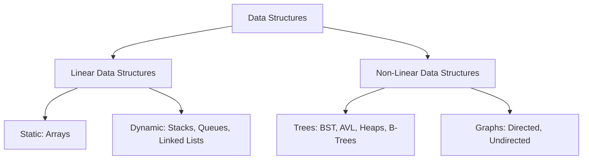
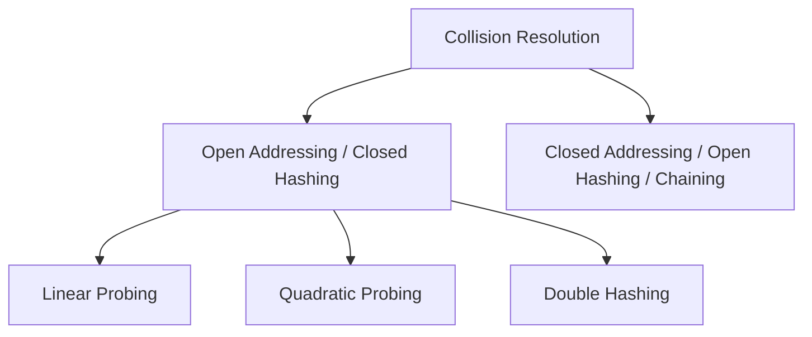

# 🧬 Data Structures & Algorithms (DSA) — Ultimate Revision Notes

> **Source:** Based on the high-yield **"Complete DS Data Structure in one shot | Semester Exam | Hindi"** One-Shot Lecture by Sanchit Sir (KnowledgeGATE).

---

## 📌 Course Outline & Timestamps
- 🕒 **00:00 - 30:30** | [Introduction to Data Structures & ADT](#-introduction-to-data-structures--abstract-data-types-adt)
- 🕒 **30:30 - 01:40:36** | [Chapter 1: Arrays (1D, 2D, 3D & Addressing Formulas)](#-chapter-1-arrays)
- 🕒 **01:40:36 - 04:12:19** | [Chapter 2: Stacks & Expression Transformations](#-chapter-2-stacks)
- 🕒 **04:12:19 - 05:36:25** | [Chapter 3: Queues (Linear, Circular, Deque & Priority)](#-chapter-3-queues)
- 🕒 **05:36:25 - 07:14:34** | [Chapter 4: Linked Lists (Singly, Doubly, Circular)](#-chapter-4-linked-lists)
- 🕒 **07:14:34 - 10:20:46** | [Chapter 5: Trees (BST, AVL, Threaded, Huffman, Heaps, B-Trees)](#-chapter-5-trees)
- 🕒 **10:20:46 - 11:05:24** | [Chapter 6: Graphs (Representations & Traversals)](#-chapter-6-graphs)
- 🕒 **11:05:24 - End** | [Chapter 7: Hashing & Collision Resolution](#-chapter-7-hashing)

---

## 📁 Introduction to Data Structures & Abstract Data Types (ADT)

A **Data Structure** is a structured way of organizing, storing, and manipulating data in a computer's memory so that operations can be performed efficiently. 



### 1. Classification Matrix

| Category | Description | Examples |
| :--- | :--- | :--- |
| **Linear** | Elements form a sequential sequence. Each element has a unique predecessor and successor (except first and last). | Arrays, Stacks, Queues, Linked Lists |
| **Non-Linear**| Elements are arranged hierarchically or in interconnected networks. | Trees, Graphs |
| **Static** | Memory size is allocated at compile-time and remains fixed. | Arrays |
| **Dynamic** | Memory size grows or shrinks dynamically at run-time. | Linked Lists, Stacks, Queues |
| **Homogeneous**| Stored elements are of the exact same data type. | Arrays |
| **Heterogeneous**| Stored elements can be of different data types. | Structures in C, Classes |

### 2. Abstract Data Type (ADT)
An **Abstract Data Type (ADT)** is a mathematical model for data types where the data type is defined by its behavior (operations and values) from the user's point of view, completely independent of its implementation details.
* **Interface (What it does):** Defines the signature of operations (e.g., `Push()`, `Pop()` for Stack).
* **Implementation (How it does it):** The actual code written using arrays, pointers, or list nodes.

---

## 📁 Chapter 1: Arrays

An **Array** is a collection of homogeneous elements stored in contiguous memory locations.

```
Array indices:     [0]     [1]     [2]     [3]     [4]
                ┌───────┬───────┬───────┬───────┬───────┐
Elements:       │   10  │   20  │   30  │   40  │   50  │
                └───────┴───────┴───────┴───────┴───────┘
Address:          1000    1004    1008    1012    1016   (assuming W = 4 bytes)
```

### 1.1 One-Dimensional (1D) Array Addressing
To find the physical memory address of any element $A[i]$ in a 1D array:
$$\text{Address}(A[i]) = BA + (i - L) \times W$$

Where:
* $BA$ = Base Address (address of the first element).
* $L$ = Lower Bound of index (usually $0$ or $1$).
* $W$ = Width/size of each element in bytes (e.g., $4$ bytes for `int`, $1$ byte for `char`).

---

### 1.2 Two-Dimensional (2D) Array Addressing
For a 2D array declared with index ranges $L_1 \le i \le U_1$ and $L_2 \le j \le U_2$:
* Number of Rows ($R$) = $U_1 - L_1 + 1$
* Number of Columns ($C$) = $U_2 - L_2 + 1$

Memory is physically 1D. Therefore, 2D arrays are mapped to 1D using two primary schemes:

#### 1️⃣ Row Major Order (RMO)
Elements are stored row-by-row. To locate $A[i][j]$:
$$\text{Address}(A[i][j]) = BA + \Big( (i - L_1) \times C + (j - L_2) \Big) \times W$$

#### 2️⃣ Column Major Order (CMO)
Elements are stored column-by-column. To locate $A[i][j]$:
$$\text{Address}(A[i][j]) = BA + \Big( (j - L_2) \times R + (i - L_1) \Big) \times W$$

---

### 1.3 Three-Dimensional (3D) Array Addressing
For a 3D array $A[L_1..U_1][L_2..U_2][L_3..U_3]$:
* Size of dimension 1 ($E_1$) = $U_1 - L_1 + 1$
* Size of dimension 2 ($E_2$) = $U_2 - L_2 + 1$
* Size of dimension 3 ($E_3$) = $U_3 - L_3 + 1$

#### 1️⃣ Row Major Order (RMO)
$$\text{Address}(A[i][j][k]) = BA + \Big( \big( (i - L_1) \times E_2 + (j - L_2) \big) \times E_3 + (k - L_3) \Big) \times W$$

#### 2️⃣ Column Major Order (CMO)
$$\text{Address}(A[i][j][k]) = BA + \Big( \big( (k - L_3) \times E_2 + (j - L_2) \big) \times E_1 + (i - L_1) \Big) \times W$$

---

## 📁 Chapter 2: Stacks

A **Stack** is a linear data structure that follows the **Last In First Out (LIFO)** principle. All insertions and deletions take place at a single end called the **top**.

```
           Stack (LIFO)
      ┌──────────────────┐
      │     Element 4    │  ◄── top
      ├──────────────────┤
      │     Element 3    │
      ├──────────────────┤
      │     Element 2    │
      ├──────────────────┤
      │     Element 1    │
      └──────────────────┘
```

### 2.1 Basic Operations & Boundary Conditions
* **`Push(element)`:** Inserts an element onto the stack.
  * **Overflow Condition:** Checked *before* pushing. If `top == MAX - 1` (for 0-indexed array), the stack is full.
* **`Pop()`:** Removes and returns the top element of the stack.
  * **Underflow Condition:** Checked *before* popping. If `top == -1`, the stack is empty.
* **`Peek() / Top()`:** Returns the top element without removing it.

---

### 2.2 Algebraic Expression Formats

* **Infix Notation:** The operator is written between operands. e.g., $A + B$.
* **Prefix Notation (Polish Notation):** The operator is written before operands. e.g., $+ A B$.
* **Postfix Notation (Reverse Polish Notation - RPN):** The operator is written after operands. e.g., $A B +$.

#### 📌 Precedence and Associativity Table
| Operator | Precedence | Associativity |
| :--- | :--- | :--- |
| Parentheses `()`, `[]` | Highest | Left to Right |
| Exponentiation `^` / `$` | High | Right to Left |
| Multiplication `*`, Division `/` | Medium | Left to Right |
| Addition `+`, Subtraction `-` | Lowest | Left to Right |

---

### 2.3 Stack Algorithms

#### 1️⃣ Infix to Postfix Conversion
**Algorithm:**
1. Initialize an empty stack and an empty output string/list.
2. Scan the Infix expression from left to right.
3. If the scanned character is an **operand**, append it to the output.
4. If it is an **open parenthesis `(`**, push it onto the stack.
5. If it is a **close parenthesis `)`**, pop from the stack and append to the output until an open parenthesis `(` is encountered. Pop and discard the `(`.
6. If it is an **operator**:
   * Pop from stack and append to output all operators that have **greater or equal precedence** than the scanned operator.
   * Push the scanned operator onto the stack.
7. Pop and append any remaining operators in the stack to the output.

#### 2️⃣ Postfix Evaluation
**Algorithm:**
1. Scan the Postfix expression from left to right.
2. If the character is an **operand**, push it onto the stack.
3. If it is an **operator**, pop two elements from the stack:
   * First pop: Right Operand ($op_2$)
   * Second pop: Left Operand ($op_1$)
4. Evaluate the operator: $\text{Result} = op_1 \ \text{[operator]} \ op_2$.
5. Push the $\text{Result}$ back onto the stack.
6. The final element left in the stack is the evaluation result.

---

### 2.4 Recursion and the Call Stack
* Recursion is implemented using the system **Call Stack**.
* Each recursive call creates an **Activation Record (Stack Frame)** containing function parameters, local variables, and the return address.
* **Tower of Hanoi:**
  * Recurrence relation: $T(n) = 2T(n-1) + 1$
  * Time Complexity: $O(2^n)$
  * Space Complexity: $O(n)$ (maximum depth of call stack).

---

## 📁 Chapter 3: Queues

A **Queue** is a linear data structure that follows the **First In First Out (FIFO)** principle. Insertions are done at the **Rear** end, and deletions are done at the **Front** end.

```
                    Queue (FIFO)
             ┌───┬───┬───┬───┬───┬───┐
      Out ◄──│ 1 │ 2 │ 3 │ 4 │ 5 │   │ ◄── In
             └───┴───┴───┴───┴───┴───┘
             ▲                       ▲
           front                   rear
```

### 3.1 Linear Queue implementation using Arrays
Initially, `front = -1` and `rear = -1`.

* **`Enqueue(element)`:**
  * If `rear == MAX - 1` $\implies$ **Queue Overflow**.
  * If queue is empty (`front == -1`), set `front = 0`, `rear = 0`.
  * Else, increment `rear` and insert `A[rear] = element`.
* **`Dequeue()`:**
  * If `front == -1` $\implies$ **Queue Underflow**.
  * Fetch `element = A[front]`.
  * If it was the last element (`front == rear`), reset `front = -1` and `rear = -1`.
  * Else, increment `front`.

> [!WARNING]
> **Drawback of Linear Queue:** If elements are dequeued, the empty slots at the beginning cannot be reused because `rear` remains at `MAX - 1`, causing false overflow errors.

---

### 3.2 Circular Queue
To reuse the freed spaces, we connect the last position back to the first position.

```
               [0]
             /     \
          [7]       [1]
          /           \
        [6]           [2]
          \           /
          [5]       [3]
             \     /
               [4]
```

* **Boundary Conditions:**
  * **Overflow:** `(rear + 1) % MAX == front`
  * **Underflow:** `front == -1`
* **Operations:**
  * **Enqueue:**
    * Check Overflow.
    * If empty: `front = 0`, `rear = 0`.
    * Else: `rear = (rear + 1) % MAX`.
    * `A[rear] = element`.
  * **Dequeue:**
    * Check Underflow.
    * `element = A[front]`.
    * If single element (`front == rear`): reset `front = -1`, `rear = -1`.
    * Else: `front = (front + 1) % MAX`.

---

### 3.3 Double-Ended Queue (Deque)
A **Deque** (pronounced 'deck') allows insertions and deletions at both ends (Front and Rear).
* **Input-Restricted Deque:** Insertions are allowed at only one end (Rear), while deletions can be made at both ends (Front & Rear).
* **Output-Restricted Deque:** Deletions are allowed at only one end (Front), while insertions can be made at both ends (Front & Rear).

### 3.4 Priority Queue
A queue where each element has a priority associated with it.
* Elements are inserted in any order, but deletion/processing is done according to priority:
  * Highest priority elements are processed first.
  * Elements with the same priority are processed in FIFO order.
* **Implementations:**
  * Unordered Array: Enqueue $O(1)$, Dequeue $O(n)$.
  * Ordered Array: Enqueue $O(n)$, Dequeue $O(1)$.
  * Binary Heap (Optimal): Enqueue $O(\log n)$, Dequeue $O(\log n)$.

---

## 📁 Chapter 4: Linked Lists

A **Linked List** is a dynamic, non-contiguous linear data structure where elements (nodes) are allocated dynamically and linked using pointers.

```
Singly Linked List (SLL):
[ Head ] ──► [ Data | * ] ──► [ Data | * ] ──► NULL
```

### 4.1 Array vs. Linked List Matrix

| Criteria | Array | Linked List |
| :--- | :--- | :--- |
| **Size** | Static (fixed at compile-time) | Dynamic (allocated at run-time) |
| **Memory Allocation** | Contiguous | Non-contiguous (scattered) |
| **Access Time** | $O(1)$ (Random access via indices) | $O(n)$ (Sequential traversal) |
| **Insertion/Deletion** | $O(n)$ (Requires shifting elements) | $O(1)$ (Only pointer manipulation) |
| **Memory Overhead** | Nil | High (Requires extra bytes for pointers) |

---

### 4.2 Types of Linked Lists

#### 1️⃣ Singly Linked List (SLL)
Each node contains a `data` field and a single `next` pointer pointing to the successor node. The last node's `next` pointer points to `NULL`.

#### 2️⃣ Doubly Linked List (DLL)
Each node contains three fields: `prev` pointer, `data`, and `next` pointer.
* Allows bidirectional traversal.
* Deletion of a given node is easier because predecessor pointer is readily available.

```
Doubly Linked List (DLL):
[ Head ] ──► [ NULL | Data | * ] ◄──► [ * | Data | * ] ◄──► [ * | Data | NULL ]
```

#### 3️⃣ Circular Linked List (CLL)
The `next` pointer of the last node points back to the first node (Head).
* No node points to `NULL`.
* Can traverse the entire list starting from any node.

---

## 📁 Chapter 5: Trees

A **Tree** is a non-linear, hierarchical data structure consisting of nodes connected by directed edges.

```
           Binary Tree Hierarchy
               [A] (Root Node) - Level 0
              /   \
            [B]   [C]           - Level 1
           /   \     \
         [D]   [E]   [F] (Leaf) - Level 2
```

### 5.1 Basic Terminology
* **Root:** The top node of a tree with no parent (e.g., $A$).
* **Leaf Node (External Node):** A node with $0$ children (e.g., $D, E, F$).
* **Degree of a Node:** Total number of children of that node.
* **Height of a Node:** The number of edges on the longest path from that node to a leaf.
* **Depth of a Node:** The number of edges from the root to that node.
* **Height of a Tree:** Height of the root node (longest path from root to any leaf).

---

### 5.2 Binary Trees
A tree where every node can have at most $2$ children (Left Child and Right Child).

#### 📊 Special Binary Tree Classifications
1. **Full (Strict) Binary Tree:** Every node has either $0$ or $2$ children. No node has $1$ child.
2. **Complete Binary Tree:** All levels are completely filled except possibly the last level, which must be filled from **left to right**.
3. **Perfect Binary Tree:** All internal nodes have exactly $2$ children, and all leaves are at the same level.
   * Total nodes in perfect binary tree of height $h$: $N = 2^{h+1} - 1$ (if root height = 0).
4. **Balanced Binary Tree:** The height difference between the left and right subtree of every node is at most $1$.

#### 💾 Memory Representations
* **Array (Sequential) Representation:** Useful for Complete/Perfect Binary Trees. For a node at index $i$ (0-indexed):
  * Left Child index = $2i + 1$
  * Right Child index = $2i + 2$
  * Parent index = $\lfloor(i - 1) / 2\rfloor$
* **Linked Representation:** Each node contains a `data` field, a `left` child pointer, and a `right` child pointer.

---

### 5.3 Tree Traversals
Standard methods for visiting all nodes in a binary tree:

```
          [Root]
          /    \
     [Left]    [Right]
```

1. **Preorder Traversal (Root $\to$ Left $\to$ Right):**
   * Visit Root, Traverse Left, Traverse Right.
2. **Inorder Traversal (Left $\to$ Root $\to$ Right):**
   * Traverse Left, Visit Root, Traverse Right.
3. **Postorder Traversal (Left $\to$ Right $\to$ Root):**
   * Traverse Left, Traverse Right, Visit Root.
4. **Level Order Traversal:**
   * Visits nodes level by level (from top to bottom, left to right). Implemented using a **Queue**.

---

### 5.4 Binary Search Tree (BST)
A Binary Tree that possesses the ordering property:
* The value of all nodes in the **left subtree** must be **less than** the parent node's value.
* The value of all nodes in the **right subtree** must be **greater than** the parent node's value.

> [!TIP]
> **Crucial Property:** The **Inorder Traversal** of a Binary Search Tree always outputs the node values in **sorted (ascending) order**.

#### ⚙️ Operations & Complexity
* **Search / Insert:** $O(h)$ where $h$ is height of tree.
  * Balanced BST: $O(\log n)$
  * Skewed BST (Worst Case): $O(n)$
* **Deletion Cases:**
  * **Case 1: Node is a Leaf.** Simply remove the node.
  * **Case 2: Node has One Child.** Bypass the node by linking its parent directly to its child.
  * **Case 3: Node has Two Children.** Replace the node's value with its **Inorder Successor** (smallest value in its right subtree) or **Inorder Predecessor** (largest value in its left subtree), then recursively delete that successor/predecessor node.

---

### 5.5 Threaded Binary Tree
* In a normal binary tree of $N$ nodes, there are $N+1$ null pointers.
* A Threaded Binary Tree utilizes these null pointers to store pointers (threads) to the node's inorder predecessor (in left null pointer) and inorder successor (in right null pointer).
* **Advantage:** Allows stack-less and recursion-less traversal of the tree.

---

### 5.6 Huffman Coding
A greedy, variable-length prefix coding algorithm used for lossless data compression.
1. Count the frequencies of all characters in the source text.
2. Place all characters as leaf nodes in a priority queue sorted by frequency.
3. Repeatedly extract the two nodes with the lowest frequencies, create a new internal node with a frequency equal to the sum of the two nodes, and insert it back into the queue.
4. The remaining single node in the queue is the root of the Huffman Tree.
5. Assign `0` to left edges and `1` to right edges. Read codes from root to leaf.

---

### 5.7 Self-Balancing Trees

#### ⚖️ AVL Trees (Adelson-Velsky and Landis)
A self-balancing Binary Search Tree where the **Balance Factor ($BF$)** of every node is restricted to:
$$BF(n) = \text{Height}(\text{Left Subtree}) - \text{Height}(\text{Right Subtree}) \in \{-1, 0, 1\}$$

If insertion or deletion causes a node's $BF$ to deviate from this range, one of four rotations is performed:

```
   Single Rotations:                    Double Rotations:
   - LL Rotation (Right Rotation)        - LR Rotation (Left then Right)
   - RR Rotation (Left Rotation)         - RL Rotation (Right then Left)
```

#### 🌲 B-Trees
A self-balancing, multiway search tree designed for disk/file systems. A B-tree of order $m$ satisfies:
* Every node has at most $m$ children.
* Every internal node (except root) has at least $\lceil m/2 \rceil$ children.
* The root has at least $2$ children if it is not a leaf.
* All leaf nodes are at the same level.
* An internal node with $k$ children contains exactly $k-1$ keys.

#### 🥞 Binary Heaps
A complete binary tree that satisfies the **Heap Property**:
* **Max-Heap:** The value of each node is $\ge$ the values of its children. (Root is maximum).
* **Min-Heap:** The value of each node is $\le$ the values of its children. (Root is minimum).
* **Complexity:**
  * Insertion: $O(\log n)$ (Insert at end, perform **Up-Heapify**).
  * Delete Min/Max: $O(\log n)$ (Replace root with last element, perform **Down-Heapify**).
  * Build Heap from unsorted array: $O(n)$ time using **Floyd's Algorithm**.

---

## 📁 Chapter 6: Graphs

A **Graph** is a non-linear data structure defined as $G = (V, E)$, consisting of a set of vertices (nodes) $V$ and a set of edges $E$ connecting these vertices.

### 6.1 Representations

#### 1️⃣ Adjacency Matrix
A 2D array of size $V \times V$ where $A[i][j] = 1$ if there is an edge between $v_i$ and $v_j$, else $0$.
* **Space Complexity:** $O(V^2)$
* **Edge lookup ($v_i \to v_j$):** $O(1)$
* Best suited for **dense graphs**.

#### 2️⃣ Adjacency List
An array of size $V$ where each index $i$ points to a linked list containing all neighbors of vertex $v_i$.
* **Space Complexity:** $O(V + E)$ for directed, $O(V + 2E)$ for undirected.
* Best suited for **sparse graphs**.

---

### 6.2 Graph Traversals

#### 1️⃣ Breadth First Search (BFS)
* **Strategy:** Level-by-level exploration.
* **Data Structure:** **Queue**.
* **Process:** Start at source $s$, visit all neighbors of $s$, then visit all unvisited neighbors of neighbors.
* **Time Complexity:** $O(V + E)$
* **Application:** Shortest path in unweighted graphs.

#### 2️⃣ Depth First Search (DFS)
* **Strategy:** Go as deep as possible down each path, backtrack when no unvisited vertices remain.
* **Data Structure:** **Stack** (or recursion).
* **Time Complexity:** $O(V + E)$
* **Application:** Cycle detection, Topological Sort, Strongly Connected Components.

---

## 📁 Chapter 7: Hashing

**Hashing** is a technique to map keys to specific index positions in a **Hash Table** of size $m$ to achieve $O(1)$ search, insertion, and deletion times.

### 7.1 Hash Functions
A hash function $h(k)$ maps key $k$ to a slot in $[0, m-1]$. Characteristics of a good hash function:
* Computationally fast.
* Distributes keys uniformly across the slots to minimize collisions.

#### Common Hash Functions:
1. **Division Method:** $h(k) = k \bmod m$ (Usually $m$ is chosen as a prime number).
2. **Mid-Square Method:** Square the key $k^2$, and extract middle $r$ digits as the index.
3. **Folding Method:** Divide the key into equal parts, add the parts, and take the modulo $m$.

---

### 7.2 Collision Resolution Techniques
A collision occurs when two different keys map to the same index: $h(k_1) = h(k_2)$ for $k_1 \neq k_2$.



#### 1️⃣ Open Addressing (Closed Hashing)
All elements are stored within the hash table itself. If a slot is occupied, search for another empty slot.
* **Linear Probing:** Search slots sequentially.
  $$h(k, i) = \big( h'(k) + i \big) \bmod m$$
  * **Drawback:** **Primary Clustering** (long runs of occupied slots build up, slowing down search times).
* **Quadratic Probing:** Search slots using a quadratic offset.
  $$h(k, i) = \big( h'(k) + c_1 i + c_2 i^2 \big) \bmod m$$
  * **Drawback:** **Secondary Clustering** (keys with same initial hash follow same probe sequence).
* **Double Hashing:** Search slots using a step size calculated by a second hash function $h_2(k)$.
  $$h(k, i) = \big( h_1(k) + i \cdot h_2(k) \big) \bmod m$$
  * **Advantage:** Eliminates both primary and secondary clustering.

#### 2️⃣ Closed Addressing (Chaining)
Each slot in the hash table points to a linked list of entries that hash to the same index.
* **Advantages:**
  * Simple to implement.
  * Table never fills up (load factor $\alpha$ can exceed $1$).
* **Disadvantage:** Extra memory overhead for pointers.
