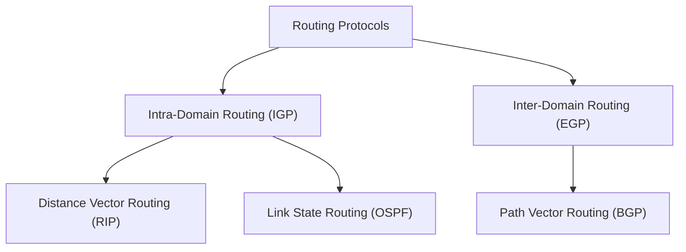

# 🌐 Computer Networks (CN) — Ultimate Revision Notes
> **Source:** Based on the high-yield **"Computer Networks | CN in one shot | Complete GATE Course"** One-Shot Lecture by Sanchit Jain (KnowledgeGate).

---

## 📌 Course Outline & Timestamps
- 🕒 **00:00 - 02:29** | [Chapter 0: Introduction](#-chapter-0-introduction)
- 🕒 **02:29 - 55:25** | [Chapter 1: Network Fundamentals & Reference Models](#-chapter-1-network-fundamentals--reference-models)
- 🕒 **55:25 - 02:55:54** | [Chapter 2: Data Link Layer & Physical Layer](#-chapter-2-data-link-layer--physical-layer)
- 🕒 **02:55:54 - 04:53:21** | [Chapter 3: Network Layer — Addressing & Routing](#-chapter-3-network-layer--addressing--routing)
- 🕒 **04:53:21 - 05:44:48** | [Chapter 4: Transport Layer & Cryptography](#-chapter-4-transport-layer--cryptography)
- 🕒 **05:44:48 - End** | [Chapter 5: Application Layer & Network Devices](#-chapter-5-application-layer--network-devices)

---

## 📌 Chapter 0: Introduction
*   **Computer Network:** A system of interconnected computers and devices that can communicate with each other and share resources (data, hardware, software).
*   **Goals of Computer Networks:**
    *   **Resource Sharing:** Accessing programs, equipment (like printers/scanners), and data regardless of physical location.
    *   **High Reliability:** Replicating files across multiple machines to prevent data loss due to hardware failure.
    *   **Cost Reduction:** Using smaller, cheaper computers instead of mainframes by distributing the workload.
    *   **Scalability:** Increasing system performance incrementally by adding more processors or storage.

---

## 📁 Chapter 1: Network Fundamentals & Reference Models

### 1.1 Data Communication Components
Data communication is the exchange of data between two devices via some form of transmission medium. It consists of five core components:

```
┌────────────────────────────────────────────────────────┐
│                        MESSAGE                         │
└────────────────────────────────────────────────────────┘
          │                                      ▲
          ▼                                      │
┌──────────────────┐   Transmission Medium    ┌──────────────────┐
│  SENDER DEVICE   │─────────────────────────>│ RECEIVER DEVICE  │
└──────────────────┘                          └──────────────────┘
    [Protocol]                                    [Protocol]
```

1.  **Message:** The information (data) to be communicated (text, numbers, pictures, audio, video).
2.  **Sender:** The device that sends the data message (computer, workstation, telephone handset, video camera).
3.  **Receiver:** The device that receives the message.
4.  **Transmission Medium:** The physical path by which a message travels from sender to receiver (twisted-pair cable, coaxial cable, fiber-optic cable, radio waves).
5.  **Protocol:** A set of rules that govern data communication. It represents an agreement between the communicating devices.

---

### 1.2 Transmission Modes
Transmission mode defines the direction of signal flow between two connected devices:

| Transmission Mode | Direction of Data Flow | Capability & Features | Example |
| :--- | :--- | :--- | :--- |
| **Simplex** | **Unidirectional:** One way only. | Only one device can transmit; the other can only receive. Uses the entire channel capacity. | Keyboard to Monitor, Radio broadcasting. |
| **Half-Duplex** | **Bidirectional, but not simultaneous:** One direction at a time. | Both devices can transmit and receive, but not at the same time. Channel capacity is shared. | Walkie-Talkie. |
| **Full-Duplex** | **Bidirectional and simultaneous:** Both directions at the same time. | Both devices can transmit and receive at the same time. Signals sharing capacity in both directions. | Mobile Phone conversation. |

---

### 1.3 Network Topologies
Network topology refers to the structural layout of a network, defining how different nodes (devices) are physically or logically connected.

#### 1. Mesh Topology
*   Every node is connected to every other node via dedicated point-to-point links.
*   **Formulas (for $N$ devices):**
    *   Number of duplex links: $L = \frac{N(N-1)}{2}$
    *   Number of ports required per device: $P = N - 1$
*   *Pros:* Highly reliable, robust (link failure doesn't affect others), secure, easy troubleshooting.
*   *Cons:* Very high cable cost, complex installation, high port count requirement.

#### 2. Star Topology
*   Each device has a dedicated point-to-point link to a central controller called a **Hub** or **Switch**.
*   *Pros:* Cheap compared to mesh, easy to install, low cable requirement, robust (single node failure doesn't crash the network).
*   *Cons:* Central point of failure (if the Hub/Switch dies, the entire network goes down).

#### 3. Bus Topology
*   A single shared main cable (the **backbone/bus**) connects all devices via drop lines and taps. Terminating resistors are used at ends to prevent signal reflection.
*   *Pros:* Very easy to install, low cabling requirements.
*   *Cons:* Limit on bus length and number of nodes, cable break crashes the whole network, difficult troubleshooting.

#### 4. Ring Topology
*   Each device is connected to two adjacent devices, forming a circular ring. Data travels in one direction (unidirectional) or both (bidirectional) using **tokens**.
*   *Pros:* Easy to install and reconfigure, no collisions.
*   *Cons:* Unidirectional traffic means a single break in the ring can disable the entire network.

#### 5. Hybrid Topology
*   A combination of two or more topologies (e.g., Star-Bus or Star-Ring).

---

### 1.4 Categories of Networks
*   **LAN (Local Area Network):** Privately owned network covering a single office, home, building, or campus (up to a few kilometers). High data rates, low delay.
*   **MAN (Metropolitan Area Network):** Covers a larger geographical area such as a city (e.g., cable TV network).
*   **WAN (Wide Area Network):** Spans a large geographical area, often a country, continent, or the entire globe (e.g., the Internet). Uses satellite or leased optical fibers.

---

### 1.5 OSI Reference Model
The **Open Systems Interconnection (OSI)** model is a conceptual 7-layer framework developed by ISO to standardize network communication.

```mermaid
graph TD
    subgraph Upper Layers "Software Layers (Host-to-Host)"
        L7["7. Application Layer (DNS, HTTP, SMTP)"]
        L6["6. Presentation Layer (Encryption, Compression, Syntax)"]
        L5["5. Session Layer (Dialog Control, Synchronization)"]
    end
    
    subgraph Heart of OSI
        L4["4. Transport Layer (TCP, UDP - End-to-End Delivery)"]
    end
    
    subgraph Lower Layers "Hardware Layers (Network-to-Network)"
        L3["3. Network Layer (IP, Routing, Logical Addressing)"]
        L2["2. Data Link Layer (Frames, Flow/Error Control, MAC)"]
        L1["1. Physical Layer (Bits, Cables, Electrical Signals)"]
    end

    L7 --> L6 --> L5 --> L4 --> L3 --> L2 --> L1
```

#### Detailed Layer-by-Layer Responsibilities:

*   **7. Application Layer:**
    *   Provides interfaces to applications to access network services.
    *   *Functions:* Resource sharing, network virtual terminal, mail services, directory services.
    *   *Protocols:* HTTP, FTP, SMTP, DNS, DHCP.
*   **6. Presentation Layer:**
    *   Deals with the syntax and semantics of the information exchanged.
    *   *Functions:* Translation (ASCII/EBCDIC), Encryption/Decryption, Compression.
*   **5. Session Layer:**
    *   Establishes, maintains, and synchronizes sessions between interacting applications.
    *   *Functions:* Dialog control (Half/Full duplex), Synchronization (inserting checkpoints in data streams).
*   **4. Transport Layer:**
    *   Ensures **Process-to-Process (End-to-End) delivery** of the entire message.
    *   *Functions:* Port Addressing, Segmentation and Reassembly, Flow Control, Error Control, Connection Control.
    *   *Protocols:* TCP, UDP.
*   **3. Network Layer:**
    *   Responsible for the source-to-destination **(Host-to-Host) delivery** of packets across multiple networks.
    *   *Functions:* Logical Addressing (IP addresses), Routing (finding best paths).
    *   *Protocols:* IPv4, IPv6, ARP, ICMP, OSPF, BGP.
*   **2. Data Link Layer (DLL):**
    *   Responsible for **Hop-to-Hop (Node-to-Node) delivery** of frames.
    *   *Functions:* Framing, Physical Addressing (MAC address), Flow Control, Error Control, Access Control (MAC sublayer).
*   **1. Physical Layer:**
    *   Responsible for transmitting individual **bits** over physical media.
    *   *Functions:* Physical characteristics of interfaces and media, Representation of bits (encoding), Data rate, Synchronization of bits, Line configuration (point-to-point/multipoint), Physical topology, Transmission mode.

---

### 1.6 Transmission Media
*   **Guided Media (Wired):**
    *   *Twisted-Pair Cable:* Two insulated copper wires twisted together. Used in telephone networks and Ethernet LANs (Category 5e, 6).
    *   *Coaxial Cable:* Copper core surrounded by insulation and metallic shield. Used in cable TV.
    *   *Fiber-Optic Cable:* Transmits signals as light pulses through glass/plastic fibers. Highest bandwidth, immune to electromagnetic interference (EMI), very low attenuation.
*   **Unguided Media (Wireless):**
    *   *Radio Waves:* Omnidirectional waves, can penetrate walls. Used for FM radio, television.
    *   *Microwaves:* Unidirectional, line-of-sight propagation. Used for satellite communication, cellular networks.
    *   *Infrared:* Short-range, line-of-sight waves that cannot penetrate walls. Used in remote controls.

---

### 1.7 Switching Techniques
Switching is used to connect multiple nodes and route data dynamically.

1.  **Circuit Switching:**
    *   Establishment of a dedicated physical path between sender and receiver before communication begins (e.g., traditional telephone network).
    *   *Features:* Guaranteed bandwidth, no congestion during data phase, high setup delay, inefficient resource utilization.
2.  **Packet Switching:**
    *   Data is broken down into small blocks called **packets**. Each packet is routed independently.
    *   *Types:*
        *   **Datagram Approach:** Each packet is treated independently. Packets may take different paths and arrive out of order (connectionless).
        *   **Virtual Circuit Approach:** A logical path is established beforehand. All packets travel along this path in order (connection-oriented).

---

## 📁 Chapter 2: Data Link Layer & Physical Layer

The Data Link Layer is divided into two sublayers: **Logical Link Control (LLC)** and **Medium Access Control (MAC)**.

### 2.1 Framing
Framing is the process of breaking a stream of bits from the physical layer into manageable data units called **frames**.
*   **Character/Byte Count:** A field in the header specifies the number of characters in the frame. If the count gets corrupted, all subsequent frame boundaries are lost.
*   **Character/Byte Stuffing:** Special characters called flag bytes are added at the beginning and end of the frame. If the flag byte pattern appears in the payload, an escape character (`ESC`) is stuffed before it.
*   **Bit Stuffing:** A flag bit pattern `01111110` marks frame boundaries. To prevent this pattern from appearing in the payload, the sender automatically inserts (stuffs) a `0` bit after five consecutive `1`s. The receiver automatically removes (unstuffs) the `0` bit.

---

### 2.2 Flow Control Protocols
Flow control prevents a fast sender from overwhelming a slow receiver.

```
                    ┌──────────────────────────────┐
                    │    FLOW CONTROL PROTOCOLS    │
                    └──────────────┬───────────────┘
          ┌────────────────────────┴────────────────────────┐
          ▼                                                 ▼
┌──────────────────┐                               ┌──────────────────┐
│   Stop-and-Wait  │                               │  Sliding Window  │
└──────────────────┘                               └────────┬─────────┘
                                           ┌────────────────┴────────────────┐
                                           ▼                                 ▼
                                  ┌──────────────────┐              ┌──────────────────┐
                                  │    Go-Back-N     │              │ Selective Repeat │
                                  └──────────────────┘              └──────────────────┘
```

#### 1. Stop-and-Wait Protocol
*   The sender sends one frame and waits for an acknowledgment (ACK) before sending the next frame.
*   **Calculations:**
    *   Transmission Delay: $T_x = \frac{L}{B}$ (where $L$ = frame size, $B$ = bandwidth)
    *   Propagation Delay: $T_p = \frac{D}{V}$ (where $D$ = distance, $V$ = speed of light in medium)
    *   Total Time for one frame cycle: $T_{total} = T_x + 2T_p$
    *   **Efficiency ($\eta$):**
        $$\eta = \frac{T_x}{T_x + 2T_p} = \frac{1}{1 + 2a} \quad \text{where } a = \frac{T_p}{T_x}$$
    *   **Throughput (Effective Data Rate):**
        $$\text{Throughput} = \eta \times \text{Bandwidth} = \frac{\text{Frame Size}}{T_x + 2T_p}$$

#### 2. Sliding Window Protocols (SWP)
Allows sending multiple frames before waiting for an ACK. The maximum number of frames that can be sent is determined by the **Sender Window Size ($W_S$)**.

*   **Optimal Window Size for max efficiency ($\eta = 1$):**
    $$W_S = 1 + 2a$$
*   **Efficiency of Sliding Window:**
    $$\eta = \frac{W_S}{1 + 2a} \quad (\text{if } W_S < 1 + 2a, \text{ else } \eta = 1)$$

| Parameter | Go-Back-N (GBN) ARQ | Selective Repeat (SR) ARQ |
| :--- | :--- | :--- |
| **Sender Window Size ($W_S$)** | $2^k - 1$ | $2^{k-1}$ |
| **Receiver Window Size ($W_R$)**| $1$ | $2^{k-1}$ ($W_S = W_R$) |
| **Relation between $W_S, W_R$**| $W_S + W_R \le 2^k$ | $W_S + W_R \le 2^k$ |
| **Out-of-order frames** | **Discarded:** Receiver only accepts next expected frame. | **Buffered:** Stored in buffer until missing frames arrive. |
| **Retransmission** | Retransmits the lost frame and **all subsequent frames** in the window. | Retransmits **only the specific lost/damaged frame** (Selective ACK used). |
| **Complexity** | Low complexity. | High complexity (timers for each frame, buffering at receiver). |

---

### 2.3 Error Control (Error Detection & Correction)
Errors can occur due to noise and attenuation. Error control uses redundant bits added to the data.

#### 1. Parity Checking
*   **Single Parity Bit:** Appends a `1` or `0` to make the total count of `1`s even (Even Parity) or odd (Odd Parity). Detects single-bit errors.
*   **Two-Dimensional Parity:** Arranges data in a grid; calculates parity for each row and column. Can detect burst errors and locate a single-bit error.

#### 2. Checksum
*   Used in IP, TCP, and UDP.
*   **Sender:** Divides data into $K$ segments of $M$ bits. Adds the segments using 1's complement arithmetic. The sum is complemented (inverted) to get the checksum, which is appended to the packet.
*   **Receiver:** Adds all segments including the checksum. If the sum is all `1`s (or `0` when complemented), data is error-free.

#### 3. Cyclic Redundancy Check (CRC)
*   Based on binary division using polynomial generator $G(X)$.
*   **Sender Algorithm:**
    1. Let data block have $m$ bits and divisor polynomial $G(X)$ have degree $r$.
    2. Append $r$ zeros to the right of the data bits.
    3. Perform modulo-2 binary division (XOR operation) on the padded data using $G(X)$ as the divisor.
    4. The remainder of this division (must be $r$ bits) is the CRC checksum.
    5. Replace the appended $r$ zeros with this remainder and transmit.
*   **Receiver Algorithm:** Divide the received frame by $G(X)$. If remainder is $0$, accept the frame; else, an error occurred.

> [!TIP]
> **CRC Example:**
> *   Data: `100100` ($m=6$)
> *   Divisor $G(X) = X^3 + X^2 + 1 \implies$ Binary `1101` (degree $r=3$)
> *   Step 1: Append 3 zeros to data: `100100000`
> *   Step 2: Modulo-2 division:
>     ```
>     100100000 XOR 1101 ...
>     Remainder = 001
>     ```
> *   Transmitted Frame: `100100001` (Data + Remainder)

#### 4. Hamming Code
An error-correcting code that can detect up to two-bit errors and correct single-bit errors.
*   **Redundant Bits Calculation:** If data has $m$ bits, we need $r$ redundant bits such that:
    $$2^r \ge m + r + 1$$
*   **Positions:** Parity bits are placed at positions that are powers of 2 ($1, 2, 4, 8, 16, \dots$). All other positions ($3, 5, 6, 7, 9, \dots$) hold data bits.
*   **Parity Generation:** Parity bit $P_i$ handles parity calculation for all positions whose binary expansion contains a $1$ in the $i$-th position.

---

### 2.4 Physical Layer Line Coding
Line coding converts digital data into digital signals.
*   **Manchester Encoding:**
    *   Transition occurs at the middle of each bit period.
    *   A '0' is represented by a High-to-Low transition, and a '1' is represented by a Low-to-High transition (or vice versa depending on standard).
    *   *Pro:* Self-synchronizing (receiver extracts clock from the transitions), no DC baseline wandering.
*   **Differential Manchester:**
    *   Transition at the middle of the bit is used for clocking. The presence/absence of transition at the beginning of the bit indicates data.

---

## 📁 Chapter 3: Network Layer — Addressing & Routing

The Network Layer handles path determination (routing) and logical addressing (IP addresses).

### 3.1 IPv4 Header Format
An IPv4 datagram has a header size ranging from **20 bytes (minimum) to 60 bytes (maximum)**.

```
 0                   1                   2                   3
 0 1 2 3 4 5 6 7 8 9 0 1 2 3 4 5 6 7 8 9 0 1 2 3 4 5 6 7 8 9 0 1
+-+-+-+-+-+-+-+-+-+-+-+-+-+-+-+-+-+-+-+-+-+-+-+-+-+-+-+-+-+-+-+-+
|Version|  IHL  |Type of Service|          Total Length         |
+-+-+-+-+-+-+-+-+-+-+-+-+-+-+-+-+-+-+-+-+-+-+-+-+-+-+-+-+-+-+-+-+
|         Identification        |Flags|      Fragment Offset    |
+-+-+-+-+-+-+-+-+-+-+-+-+-+-+-+-+-+-+-+-+-+-+-+-+-+-+-+-+-+-+-+-+
|  Time to Live |    Protocol   |        Header Checksum        |
+-+-+-+-+-+-+-+-+-+-+-+-+-+-+-+-+-+-+-+-+-+-+-+-+-+-+-+-+-+-+-+-+
|                         Source IP Address                     |
+-+-+-+-+-+-+-+-+-+-+-+-+-+-+-+-+-+-+-+-+-+-+-+-+-+-+-+-+-+-+-+-+
|                      Destination IP Address                   |
+-+-+-+-+-+-+-+-+-+-+-+-+-+-+-+-+-+-+-+-+-+-+-+-+-+-+-+-+-+-+-+-+
|                    Options (0-40 bytes) if any                |
+-+-+-+-+-+-+-+-+-+-+-+-+-+-+-+-+-+-+-+-+-+-+-+-+-+-+-+-+-+-+-+-+
```

#### Description of Key Fields:
1.  **Version (4 bits):** Identifies the IP version (e.g., `0100` for IPv4).
2.  **Header Length / IHL (4 bits):** Length of header in 32-bit (4-byte) words. Value ranges from $5$ to $15$ ($5 \times 4 = 20$ bytes minimum; $15 \times 4 = 60$ bytes maximum).
3.  **Total Length (16 bits):** Defines total length of datagram (Header + Data) in bytes. Max length = $2^{16} - 1 = 65,535$ bytes.
4.  **Identification (16 bits), Flags (3 bits), Fragment Offset (13 bits):** Used for packet fragmentation.
    *   **Flags:**
        *   Bit 0: Reserved (must be 0).
        *   Bit 1: DF (Don't Fragment). If 1, fragmentation is disabled.
        *   Bit 2: MF (More Fragments). If 1, more fragments follow; if 0, this is the last fragment.
    *   **Fragment Offset:** Position of the fragment in the original IP datagram, measured in units of 8-byte blocks.
5.  **Time to Live / TTL (8 bits):** A hop counter to prevent routing loops. Decremented by 1 at each router. If it hits 0, packet is dropped and ICMP "Time Exceeded" is sent.
6.  **Protocol (8 bits):** Indicates which higher-layer protocol (TCP = 6, UDP = 17, ICMP = 1) gets the payload.

---

### 3.2 IP Addressing (IPv4)
An IPv4 address is 32 bits long, divided into 4 octets (bytes) separated by dots.

#### 1. Classful Addressing
Addresses are divided into five classes based on the first octet values:

| Class | Leading Bits | First Octet Range | NetID / HostID Bits | Number of Networks | Hosts per Network | Subnet Mask |
| :---: | :---: | :---: | :---: | :---: | :---: | :---: |
| **A** | `0` | `1 – 126` (127 reserved) | 8 NetID / 24 HostID | $2^7 - 2 = 126$ (0 and 127 special) | $2^{24} - 2 = 16,777,214$ | `255.0.0.0` |
| **B** | `10` | `128 – 191` | 16 NetID / 16 HostID | $2^{14} = 16,384$ | $2^{16} - 2 = 65,534$ | `255.255.0.0` |
| **C** | `110` | `192 – 223` | 24 NetID / 8 HostID | $2^{21} = 2,097,152$ | $2^8 - 2 = 254$ | `255.255.255.0` |
| **D** | `1110` | `224 – 239` | Multicast Addressing | N/A | N/A | N/A |
| **E** | `1111` | `240 – 255` | Experimental / Research| N/A | N/A | N/A |

*   **Special IP Ranges:**
    *   `127.0.0.0` to `127.255.255.255` $\rightarrow$ Loopback testing (local host).
    *   **Private IP Addresses (Non-routable on WAN):**
        *   Class A: `10.0.0.0` to `10.255.255.255`
        *   Class B: `172.16.0.0` to `172.31.255.255`
        *   Class C: `192.168.0.0` to `192.168.255.255`

#### 2. Subnetting
Subnetting is the practice of dividing a large network into smaller, logical subnetworks.
*   **Concept:** Borrow bits from the HostID portion to create a SubnetID.
*   **Subnet Mask:** A sequence of 1s followed by 0s. The 1s represent the network/subnet portion, and 0s represent the host portion.

> [!IMPORTANT]
> **Subnetting Calculation Checklist:**
> *   **Network Address:** Bitwise AND of the IP address with the subnet mask.
> *   **Directed Broadcast Address (DBA):** Set all HostID bits to `1` in the IP address matching the subnet.
> *   **First Host IP:** Network Address + 1.
> *   **Last Host IP:** Directed Broadcast Address - 1.
> *   **Total Host IPs in Subnet:** $2^{\text{Number of } 0\text{s in mask}} - 2$.

#### 3. Classless Inter-Domain Routing (CIDR)
CIDR replaces classful system with a flexible prefix length notation: `IP/n` (where `n` is the prefix length or netmask).
*   **Rules for CIDR block assignment:**
    1. Addresses in a block must be contiguous.
    2. The block size must be a power of 2 ($2^x$).
    3. The first address of the block must be evenly divisible by the block size.

---

### 3.3 Routing Protocols & Algorithms



#### 1. Distance Vector Routing (DVR)
*   **Algorithm:** Bellman-Ford equation. Each router maintains a routing table of distances to all destinations.
*   Routers share their complete routing tables **periodically** only with **direct neighbors**.
*   **Count-to-Infinity Problem:** A routing loop occurs when a link breaks, causing routers to update metrics based on outdated data, incrementing cost to infinity.
    *   *Solutions:*
        1.  **Split Horizon:** A router should not advertise a route back out the same interface it learned it from.
        2.  **Route Poisoning:** Immediately set the metric of a broken link to infinity ($\infty = 16$ in RIP) and advertise it.

#### 2. Link State Routing (LSR)
*   **Algorithm:** Dijkstra's shortest path algorithm.
*   Each router discovers its neighbors, measures cost to them, and creates a **Link State Packet (LSP)**.
*   LSPs are flooded to **all routers** in the network. Each router builds the exact same network topology map.
*   *Protocol:* OSPF (Open Shortest Path First).

---

### 3.4 Auxiliary Network Protocols
*   **ARP (Address Resolution Protocol):** Resolves a known logical IP address to a physical MAC address.
*   **RARP (Reverse ARP):** Resolves physical MAC address to logical IP (obsolete; DHCP used instead).
*   **ICMP (Internet Control Message Protocol):** Used by hosts and routers to send error reports (e.g., Destination Unreachable, Time Exceeded) and query messages (Ping).
*   **IGMP (Internet Group Management Protocol):** Manages multicast group memberships for IPv4 hosts.

---

## 📁 Chapter 4: Transport Layer & Cryptography

The transport layer is responsible for process-to-process delivery, managing connection states, flow control, and congestion control.

### 4.1 Transport Layer Fundamentals
*   **Port Numbers:** 16-bit identifier ($0$ to $65,535$) used to target specific processes on a host.
    *   *Well-known ports:* $0 – 1023$ (e.g., HTTP = 80, SSH = 22, HTTPS = 443).
    *   *Registered ports:* $1024 – 49151$.
    *   *Dynamic/Ephemeral ports:* $49152 – 65535$.
*   **Socket Address:** Combines logical IP address and port number (e.g., `192.168.1.1:80`).

---

### 4.2 UDP (User Datagram Protocol)
*   **Features:** Connectionless, unreliable, best-effort delivery, message-oriented.
*   **Header Size:** Fixed at **8 bytes**.

```
 0                   1                   2                   3
 0 1 2 3 4 5 6 7 8 9 0 1 2 3 4 5 6 7 8 9 0 1 2 3 4 5 6 7 8 9 0 1
+-+-+-+-+-+-+-+-+-+-+-+-+-+-+-+-+-+-+-+-+-+-+-+-+-+-+-+-+-+-+-+-+
|          Source Port          |        Destination Port       |
+-+-+-+-+-+-+-+-+-+-+-+-+-+-+-+-+-+-+-+-+-+-+-+-+-+-+-+-+-+-+-+-+
|             Length            |            Checksum           |
+-+-+-+-+-+-+-+-+-+-+-+-+-+-+-+-+-+-+-+-+-+-+-+-+-+-+-+-+-+-+-+-+
```

---

### 4.3 TCP (Transmission Control Protocol)
*   **Features:** Connection-oriented, reliable, byte-stream delivery, full-duplex, implements flow and congestion control.
*   **Header Size:** Ranges from **20 bytes to 60 bytes** (depending on Options).

```
 0                   1                   2                   3
 0 1 2 3 4 5 6 7 8 9 0 1 2 3 4 5 6 7 8 9 0 1 2 3 4 5 6 7 8 9 0 1
+-+-+-+-+-+-+-+-+-+-+-+-+-+-+-+-+-+-+-+-+-+-+-+-+-+-+-+-+-+-+-+-+
|          Source Port          |        Destination Port       |
+-+-+-+-+-+-+-+-+-+-+-+-+-+-+-+-+-+-+-+-+-+-+-+-+-+-+-+-+-+-+-+-+
|                        Sequence Number                        |
+-+-+-+-+-+-+-+-+-+-+-+-+-+-+-+-+-+-+-+-+-+-+-+-+-+-+-+-+-+-+-+-+
|                    Acknowledgment Number                      |
+-+-+-+-+-+-+-+-+-+-+-+-+-+-+-+-+-+-+-+-+-+-+-+-+-+-+-+-+-+-+-+-+
|  Data |           |U|A|P|R|S|F|                               |
| Offset| Reserved  |R|C|S|S|Y|I|          Window Size          |
|       |           |G|K|H|T|N|N|                               |
+-+-+-+-+-+-+-+-+-+-+-+-+-+-+-+-+-+-+-+-+-+-+-+-+-+-+-+-+-+-+-+-+
|           Checksum            |         Urgent Pointer        |
+-+-+-+-+-+-+-+-+-+-+-+-+-+-+-+-+-+-+-+-+-+-+-+-+-+-+-+-+-+-+-+-+
|                    Options (0 to 40 bytes)                    |
+-+-+-+-+-+-+-+-+-+-+-+-+-+-+-+-+-+-+-+-+-+-+-+-+-+-+-+-+-+-+-+-+
```

*   **Sequence Number (32 bits):** Byte stream track number of the first data byte in this segment.
*   **Acknowledgment Number (32 bits):** The next byte sequence number the receiver expects to receive. It is **cumulative**.
*   **Header Length / Data Offset (4 bits):** Length of TCP header in 32-bit words (value $5$ to $15$).
*   **Control Flags (6 bits):**
    *   `URG`: Urgent pointer is valid.
    *   `ACK`: Acknowledgment field is valid.
    *   `PSH`: Push data directly to application layer (bypass buffer).
    *   `RST`: Reset the connection.
    *   `SYN`: Synchronize sequence numbers during handshake.
    *   `FIN`: Terminate connection.
*   **Window Size (16 bits):** Used for receiver-side Flow Control. Tells the sender how many bytes the receiver is willing to accept.

---

### 4.4 TCP 3-Way Handshake
Establishes a connection between client and server safely.

```
       CLIENT                                      SERVER
         │                                            │
         │             SYN, Seq = X                   │
         │───────────────────────────────────────────>│ (Listen)
         │                                            │
         │         SYN-ACK, Seq = Y, Ack = X + 1      │
         │<───────────────────────────────────────────│ (SYN Received)
         │                                            │
         │             ACK, Seq = X + 1, Ack = Y + 1  │
         │───────────────────────────────────────────>│ (Established)
         ▼                                            ▼
```

*   **Connection Termination:** Uses a 4-way exchange (`FIN` $\rightarrow$ `ACK` $\rightarrow$ `FIN` $\rightarrow$ `ACK`) as TCP supports half-closed connections.

---

### 4.5 TCP Congestion Control
To prevent network collapse, the sender controls speed using a dynamically sized **Congestion Window ($Cwnd$)**. The sender's transmission limit is:
$$\text{Effective Window Size} = \min(Cwnd, \text{Receiver Window Size})$$

```
  Cwnd Size
    │                                            / (Timeout: drop Cwnd to 1)
    │                                  / \      /
    │                        / \  / \ /   \    /
    │             / \       /   \/
    │            /   \     /
    │     / \   /     \___/
    │    /   \_/
    └───┴─────────────────────────────────────────► Time
       Slow   Congestion   Fast Retransmit/
       Start  Avoidance    Fast Recovery
```

1.  **Slow Start Phase:**
    *   Starts with $Cwnd = 1$ MSS.
    *   For every ACK received, $Cwnd$ doubles every Round Trip Time (RTT). Grows **exponentially**.
    *   Continues until $Cwnd$ reaches the Slow Start Threshold ($Ssthresh$).
2.  **Congestion Avoidance Phase:**
    *   Once $Cwnd \ge Ssthresh$, growth switches to **additive** ($Cwnd$ increases by 1 MSS per RTT).
3.  **Handling Packet Loss:**
    *   **Case A: Timeout occurs** (Severe Congestion):
        *   $Ssthresh \leftarrow \frac{Cwnd}{2}$
        *   $Cwnd \leftarrow 1$
        *   Go back to **Slow Start** phase.
    *   **Case B: Three Duplicate ACKs received** (Mild Congestion - Fast Retransmit):
        *   $Ssthresh \leftarrow \frac{Cwnd}{2}$
        *   $Cwnd \leftarrow Ssthresh$ (or $Ssthresh + 3$ in TCP Reno)
        *   Enter **Fast Recovery** phase (Additive Increase).

---

### 4.6 Cryptography Basics
Cryptography ensures security, integrity, and authenticity across networks.

*   **Symmetric Key (Private Key):** Same key is used for encryption and decryption. Very fast.
    *   *Examples:* DES (Data Encryption Standard), AES (Advanced Encryption Standard).
*   **Asymmetric Key (Public Key):** Uses a public key for encryption and a private key for decryption.
    *   *Examples:* RSA Algorithm.

> [!NOTE]
> **RSA Mathematical Framework:**
> 1. Select two large prime numbers, $p$ and $q$.
> 2. Calculate $n = p \times q$ and $\phi(n) = (p - 1)(q - 1)$.
> 3. Choose public exponent $e$ such that $1 < e < \phi(n)$ and $\text{GCD}(e, \phi(n)) = 1$.
> 4. Calculate private exponent $d$ such that $(d \times e) \equiv 1 \pmod{\phi(n)}$.
> 5. **Encryption:** $C = M^e \pmod n$ (where $C$ = Ciphertext, $M$ = Plaintext).
> 6. **Decryption:** $M = C^d \pmod n$.

---

## 📁 Chapter 5: Application Layer & Network Devices

### 5.1 Application Layer Protocols

#### 1. Domain Name System (DNS)
*   Translates human-readable domain names (e.g., `google.com`) to IP addresses. Runs on **UDP Port 53**.
*   **Resolution Modes:**
    *   **Recursive Query:** Client asks DNS server; server does all steps and returns exact IP.
    *   **Iterative Query:** DNS server points client to other nameservers (Root -> TLD -> Authoritative).

#### 2. E-Mail Architecture
*   Uses **SMTP (Simple Mail Transfer Protocol)** to push messages from client to mail server and between mail servers (**Port 25**).
*   Uses **POP3** (**Port 110**) or **IMAP4** (**Port 143**) to pull messages from mail server to client. IMAP supports folder synchronization and message status tracks; POP3 simply downloads and deletes.
*   **MIME (Multipurpose Internet Mail Extensions):** Extends SMTP to allow non-ASCII data (attachments, media).

#### 3. FTP (File Transfer Protocol)
*   Uses two separate TCP connections (**Out-of-band control**):
    *   **Port 21:** Control Connection (handles commands/responses; stays open).
    *   **Port 20:** Data Connection (opens/closes dynamically for each file transfer).

#### 4. HTTP (HyperText Transfer Protocol)
*   Used to access web content. Works on **Port 80** (HTTPS uses **Port 443** for SSL/TLS encryption).
*   **Connections:**
    *   *Non-Persistent (HTTP/1.0):* Opens a separate TCP connection for every object request.
    *   *Persistent (HTTP/1.1):* Keeps TCP connection open for multiple requests, reducing latency.
*   **Status Codes:**
    *   `1xx` $\rightarrow$ Informational
    *   `2xx` $\rightarrow$ Success (e.g., `200 OK`)
    *   `3xx` $\rightarrow$ Redirection (e.g., `301 Moved Permanently`)
    *   `4xx` $\rightarrow$ Client Error (e.g., `404 Not Found`)
    *   `5xx` $\rightarrow$ Server Error (e.g., `500 Internal Server Error`)

---

### 5.2 Network Interconnection Devices
Devices function at different layers of the OSI stack, processing specific data encapsulation structures:

| Device | Working OSI Layer | Data Unit Handled | Key Feature / Functionality |
| :--- | :--- | :--- | :--- |
| **Repeater** | Physical Layer (Layer 1) | Bits | Regenerates weak electrical/optical signals to extend transmission distance. Does not filter data. |
| **Hub** | Physical Layer (Layer 1) | Bits | Multi-port repeater. Broadcasts incoming data to all output ports. High collision rate. |
| **Bridge** | Data Link Layer (Layer 2) | Frames | Connects two LAN segments. Filters and forwards frames using MAC address tables. |
| **Switch** | Data Link Layer (Layer 2) | Frames | Multi-port bridge. Learns MAC addresses dynamically and forwards packets selectively, eliminating collisions per port. |
| **Router** | Network Layer (Layer 3) | Packets | Interconnects different logical networks. Selects optimal paths using routing tables and IP addresses. |
| **Gateway** | All Layers (Layer 1–7) | Packets/Application Data | Protocol translator. Translates data formats, formats packets, or runs security layers between fully incompatible networks. |
| **Firewall** | Network/Transport/Application | Packets/Session Data | Inspects packets and filters traffic based on pre-defined security policies (ports, IPs, protocols). |
